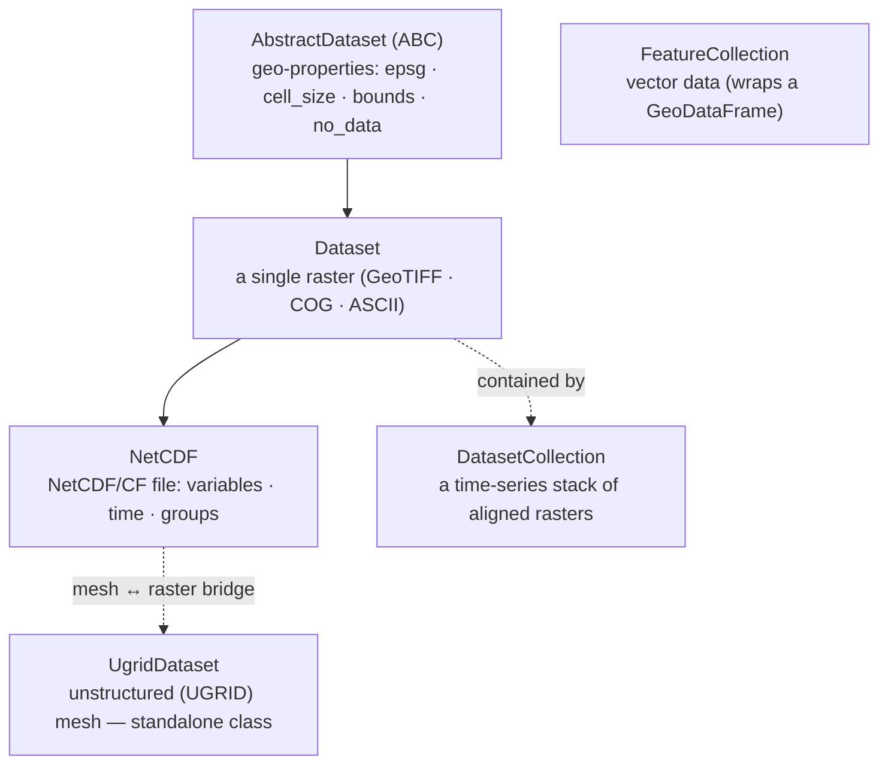

# Core concepts & terminology

pyramids has a small object model and borrows GDAL/OGR vocabulary. This page explains **which class to reach
for**, the **container-vs-variable** idea behind NetCDF, and the **words** that show up throughout the docs. Read
it once and the rest of the docs (and the API) click into place.

## The object model — which class do I use?



| Your data | Use | Notes |
|-----------|-----|-------|
| One raster — GeoTIFF, COG, ASCII grid | **`Dataset`** | bands, no-data, crop/reproject/align/mosaic, COG, overviews |
| A NetCDF / CF file (variables, time, packed, curvilinear, WRF, groups) | **`NetCDF`** | extends `Dataset`; adds variable & time handling |
| An unstructured (UGRID) mesh | **`UgridDataset`** | triangular/polygonal meshes; mesh↔raster bridge |
| Many aligned rasters as one time cube | **`DatasetCollection`** | temporal stack backed by a base `Dataset`; Zarr I/O |
| Vector — Shapefile, GeoJSON, GeoPackage, GeoParquet | **`FeatureCollection`** | wraps a GeoPandas `GeoDataFrame`; rasterize / geometry ops |

!!! note "Everything is CRS-aware and GDAL-backed"
    `Dataset` (and its subclasses) wrap a live `gdal.Dataset`; `FeatureCollection` wraps an `ogr.DataSource` +
    a `GeoDataFrame`. You work with Python objects and attributes — never raw `osgeo.gdal`/`ogr` pointers.

## Container vs. variable (NetCDF)

A NetCDF file holds *several* variables, so `NetCDF.read_file` cannot return "a raster" — it returns a
**container**: a `NetCDF` with `band_count == 0` that describes the whole file. Pin one variable and you get a
**variable**: a `NetCDF` with `band_count >= 1` that behaves like a single raster.

```python
nc = NetCDF.read_file("air.nc")     # Container: band_count == 0
nc.variable_names                    # ['t2m', 'tp', ...]
t2m = nc.get_variable("t2m")         # Variable: band_count >= 1 — read_array / crop / plot / to_file
grp = nc.get_group("subgroup")       # a nested netCDF-4 group, itself a container
```

`get_variable` / `variables[name]` / `sel` / `subset` all narrow a container to a variable. See the
[NetCDF reference](reference/netcdf/index.md) for the full model.

## Glossary

Terms used across the docs and API, each with the pyramids call that surfaces it.

- **CRS / EPSG** — coordinate reference system. `ds.epsg` returns the integer code; `ds.crs` the WKT;
  `ds.to_crs(4326)` reprojects. See [CRS helpers](reference/base/crs.md).
- **Geotransform** — the six-number affine mapping pixel (row, col) → map (x, y): `ds.geotransform`.
- **Cell size** — pixel size in CRS units (`ds.cell_size`); resample with `ds.resample(...)`.
- **Bounds / bbox / extent** — the raster's spatial envelope: `ds.bbox` (min-x, min-y, max-x, max-y).
- **Band** — one 2-D layer of a raster (`ds.band_count`, `ds.read_array(band=0)`). In a datacube the third axis
  is usually **time**, not bands; in a NetCDF a **variable** plays the role a band does in a GeoTIFF.
- **No-data value** — the sentinel marking "no measurement" per band: `ds.no_data_value`. Masks derive from it
  (`ds.mask_flags()`, `ds.read_masks()`).
- **Overview / image pyramid** — decimated lower-resolution copies for fast zoom-out (`ds.create_overviews()`,
  `ds.read_overview_array(...)`). (The library is named for these.)
- **COG** — Cloud-Optimized GeoTIFF: a tiled+overviewed GeoTIFF laid out for HTTP range reads
  (`ds.to_cog(...)`, `ds.validate_cog(...)`). See the [COG guide](tutorials/cog.md).
- **VSI / virtual filesystem** — GDAL's URL layer. pyramids rewrites `s3://` / `gs://` / `az://` /
  `http(s)://` and zip/tar/gzip into GDAL `/vsi*/` paths automatically, so `read_file` opens cloud and archived
  data directly.
- **Driver / Catalog** — the GDAL/OGR format handler chosen from the file extension (via the internal
  `Catalog`); usually invisible, override with `driver=` on write.
- **Subdataset** — a named sub-array inside a multi-array container (NetCDF/HDF); surfaced as variables.
- **Datacube** — a time (or otherwise stacked) series of aligned rasters — a `DatasetCollection`. (The older
  name "Datacube" is retired; use `DatasetCollection`.)
- **Lazy / chunked / Dask** — deferred, block-wise reads. `ds.read_array(chunks="auto")` returns a Dask array;
  see the [Lazy / Dask guide](tutorials/lazy/lazy-compute.md).
- **CF / COARDS / UGRID** — NetCDF metadata conventions for georeferencing gridded and mesh data; all
  first-class here (see the [NetCDF](reference/netcdf/index.md) and [UGRID](reference/netcdf/ugrid/index.md)
  references).

## Where things live in the docs

pyramids follows the [Diátaxis](https://diataxis.fr/) split:

- **Learning** → [Quickstart](quickstart.md) and the [tutorials](tutorials/dataset.md).
- **Doing** → the task-oriented [“How do I…?” index](examples/index.md) over 49 runnable notebooks.
- **Looking up** → the [API Reference](reference/dataset/index.md).
- **Understanding** → this page, plus [Overview / architecture](overview/architecture.md) and
  [SCOPE](SCOPE.md).
