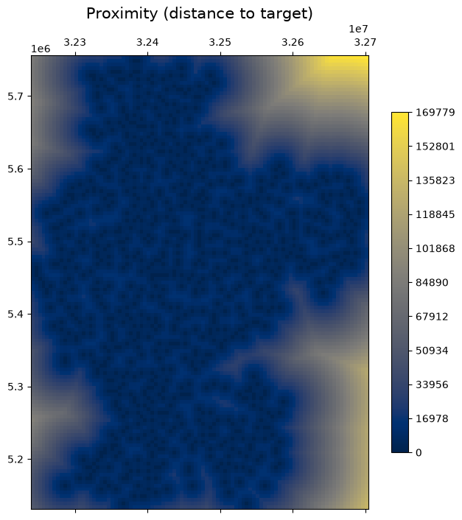
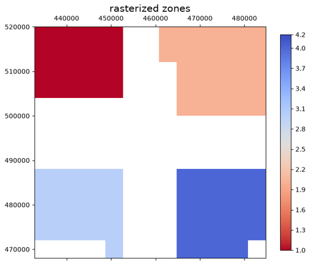
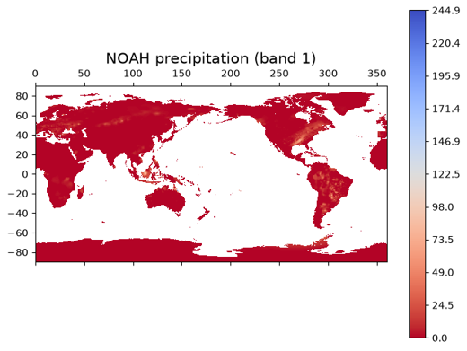
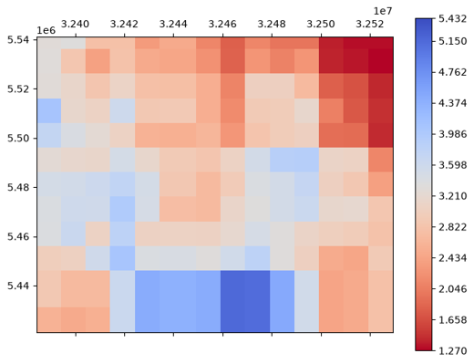
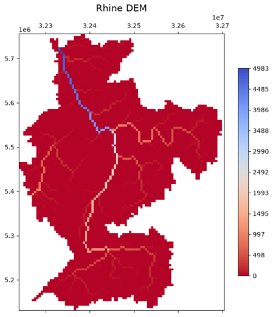
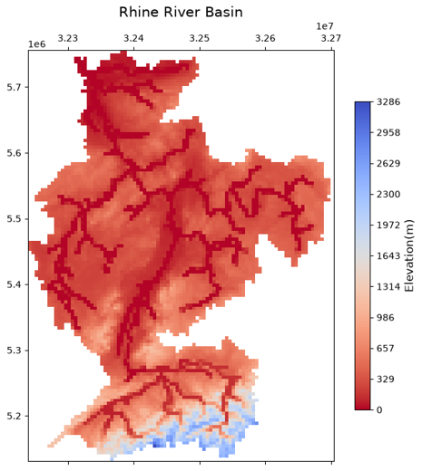

# Example gallery

Browse examples visually. Every card links to a **runnable notebook** that executes offline on the repository's
sample data. Prefer a task list? See the ["How do I…?" index](index.md).

## Featured

-   

    **[Terrain analysis](operations/terrain-analysis.ipynb)** — slope, aspect, hillshade and proximity from a DEM.

-   

    **[Rasterize ↔ vectorize](operations/rasterize-vectorize.ipynb)** — burn a vector to a grid and polygonize
    it back.

-   

    **[COG with real data](cog/cog-real-data.ipynb)** — write, validate, inspect and range-read
    Cloud-Optimized GeoTIFFs.

-   

    **[Mosaic & merge](operations/mosaic-merge.ipynb)** — stitch tiles into one raster and stack bands.

-   

    **[Visualization gallery](operations/visualization.ipynb)** — images, plots, histograms and colour scales.

-   

    **[Spatial operations](dataset/spatial-operation-methods.ipynb)** — crop, reproject, resample and align on
    a real basin.

## Browse by theme

-   :material-swap-horizontal: **Read, write & convert**

    ---

    [Dataset basics](dataset/dataset.ipynb) · [GeoTIFF ↔ NetCDF](conversions/geotiff-netcdf.ipynb) ·
    [Raster formats](conversions/raster-formats.ipynb) · [Vector formats](conversions/vector-formats.ipynb) ·
    [Windowed & tiled reads](operations/windowed-reads.ipynb)

-   :material-crop: **Transform & align**

    ---

    [Reproject / resample / align](operations/reproject-resample-align.ipynb) ·
    [Crop & mask](operations/crop-mask.ipynb) · [Mosaic & merge](operations/mosaic-merge.ipynb) ·
    [No-data & gap filling](operations/nodata-gap-filling.ipynb) · [Overviews](operations/overviews.ipynb)

-   :material-calculator-variant: **Analyse**

    ---

    [Zonal statistics](operations/zonal-statistics.ipynb) · [Extract at points](operations/extract-at-points.ipynb) ·
    [Terrain analysis](operations/terrain-analysis.ipynb) · [Raster algebra](operations/raster-algebra.ipynb)

-   :material-vector-polygon: **Vector & raster ↔ vector**

    ---

    [Rasterize ↔ vectorize](operations/rasterize-vectorize.ipynb) ·
    [Vector geometry toolkit](operations/vector-geometry.ipynb) ·
    [Vector tessellation](operations/vector-tessellation.ipynb)

-   :material-image-multiple: **Visualize**

    ---

    [Visualization gallery](operations/visualization.ipynb) · [Colour tables](operations/color-tables.ipynb) ·
    [Basemaps](basemap/basemap-example.ipynb) · [RGB animation](dataset/rgb_animation.ipynb)

-   :material-cube-outline: **NetCDF · UGRID · datacubes**

    ---

    [Dataset collection](dataset/dataset_collection.ipynb) ·
    [UGRID mesh exploration](netcdf/ugrid/ugrid-mesh-exploration.ipynb) ·
    [UGRID river channel](netcdf/ugrid/ugrid-river-channel.ipynb)

-   :material-database-outline: **Zarr & lazy / Dask**

    ---

    [Zarr basics](zarr/zarr-basics.ipynb) · [Zarr cubes](zarr/zarr-cube.ipynb) ·
    [Multiscale pyramids](zarr/zarr-pyramid-preview.ipynb) · [Dask overview](dask/overview.ipynb)

-   :material-cloud-outline: **Cloud & STAC**

    ---

    [STAC (offline)](stac/stac-local.ipynb) · [STAC (live)](stac/stac-cloud-earth-search.ipynb) ·
    [Dask on cloud COGs](dataset/dask-lazy-datasets.ipynb)

Looking for something specific? The [“How do I…?” index](index.md) maps every task to its notebook.
