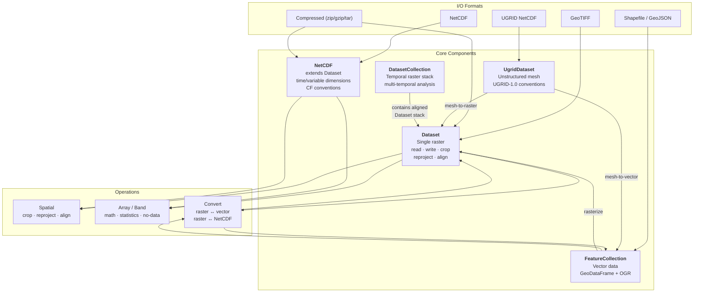
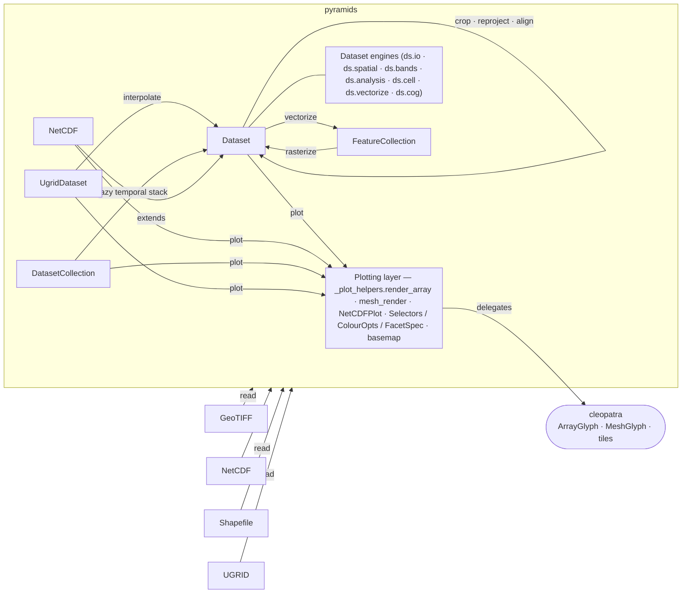
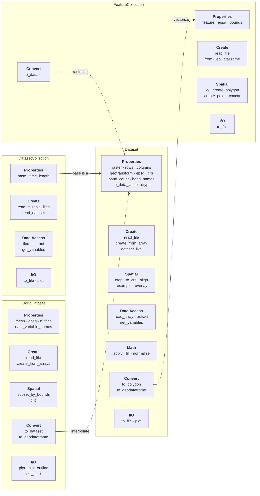
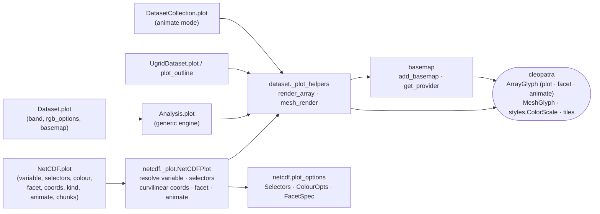

# Architecture

## High-Level Overview

## Class Relationships & Internal Layers

How the classes relate to each other, the engine mixins behind the `Dataset` facade, and the
plotting layer's delegation to cleopatra:

## Class API Overview

## Plotting layer

`Dataset.plot` / `NetCDF.plot` / `DatasetCollection.plot` / `UgridDataset.plot` are thin facades
over a shared core in `pyramids.dataset._plot_helpers` (`render_array` for arrays, `mesh_render`
for meshes), which builds a [cleopatra](https://github.com/serapeum-org/cleopatra) glyph and
dispatches to `plot` / `facet` / `animate`. `NetCDF.plot` adds the NetCDF-specific resolver
`pyramids.netcdf._plot.NetCDFPlot` (variable / selector / curvilinear-coord / facet / animate
resolution) and the grouped option dataclasses `Selectors` / `ColourOpts` / `FacetSpec`
(`pyramids.netcdf.plot_options`, re-exported from `pyramids.netcdf`).
`pyramids.basemap.add_basemap` / `get_provider` are thin wrappers over `cleopatra.tiles`.

