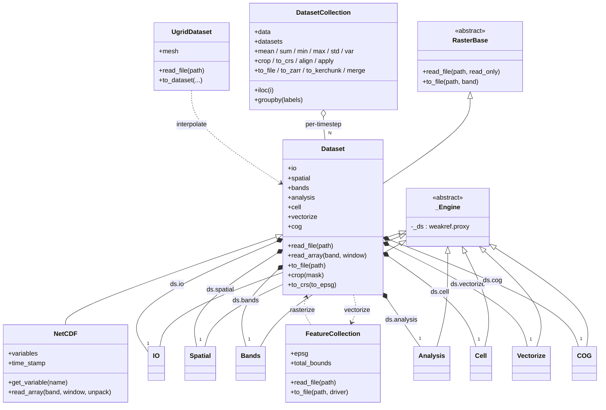

# Codebase Map

This page summarizes the main modules, key classes, and the public API surface
of the `pyramids` package.

## Packages and Modules

- `pyramids.base`
  - Cross-cutting primitives shared across the raster and vector subpackages:
    - `pyramids.base.crs` — single source of truth for `osr.SpatialReference`
      construction (`sr_from_epsg`, `sr_from_wkt`, `create_sr_from_proj`,
      `epsg_from_wkt`, `reproject_coordinates`).
    - `pyramids.base._domain` — `is_no_data` / `inside_domain` helpers
      (NaN- / None-safe nodata domain masks).
    - `pyramids.base._file_manager` — pickle-safe `CachingFileManager` /
      `ThreadLocalFileManager` plus the process-global `FILE_CACHE` LRU.
    - `pyramids.base._raster_meta` — `RasterMeta` snapshot type (geobox + dtype
      + nodata) used by lazy paths.
    - `pyramids.base._utils`, `pyramids.base._errors`, `pyramids.base.protocols`,
      `pyramids.base.remote`, `pyramids.base.config`, `pyramids.base._locks`.
- `pyramids.dataset`
  - Raster data subpackage: `Dataset` (concrete GeoTIFF wrapper),
    `DatasetCollection` (temporal stack), and `RasterBase` (ABC). Engine
    collaborators live under `pyramids.dataset.engines.*`. Free-function
    helpers under `pyramids.dataset.ops.*` (focal, zarr, zonal,
    reproject, vectorize, io). Merge entry points in
    `pyramids.dataset.merge`. Reduction op dispatcher in
    `pyramids.dataset._reduce_ops`.
- `pyramids.dataset.engines`
  - The seven Dataset engine classes: `IO`, `Spatial`, `Bands`, `Analysis`,
    `Cell`, `Vectorize`, `COG`. Each engine instance lives on the parent
    `Dataset` (e.g. `ds.spatial`, `ds.io`). Engines hold a `weakref.proxy`
    back-reference to the Dataset.
- `pyramids.dataset.cog`
  - COG creation options, validate / write helpers backing `ds.cog`.
- `pyramids.netcdf`
  - `NetCDF` (extends Dataset for NetCDF files, classic + multidimensional),
    plus CF-convention support, kerchunk side-cars, and an MFDataset reader.
  - `pyramids.netcdf.ugrid` — `UgridDataset` (UGRID-1.0 unstructured meshes,
    triangles / quads / mixed) and an interpolation pathway to `Dataset`.
- `pyramids.feature`
  - `FeatureCollection` (GeoPandas + OGR DataSource hybrid) and the
    `Coords` / `GeometryCoords` value-object classes that replace the old
    static-method shims.
- `pyramids.basemap`
  - `add_basemap` / `get_provider` — thin wrappers over `cleopatra.tiles`
    (the `[viz]` extra's `cleopatra[tiles]`) for web-tile plot underlays.
- `pyramids._io`
  - Compressed-archive (zip/gzip/tar) and remote-URL (`s3://`, `gs://`,
    `az://`, `http(s)://`, `file://`) handling via GDAL's virtual
    filesystem.

## Key Public Classes

- `pyramids.dataset.Dataset`
- `pyramids.dataset.DatasetCollection`
- `pyramids.netcdf.NetCDF`
- `pyramids.netcdf.ugrid.UgridDataset`
- `pyramids.feature.FeatureCollection`

## Representative Public API

- `Dataset`
  - Constructors: `read_file(path, read_only=True)`, `create_from_array(arr, ...)`,
    `dataset_like(template, ...)`.
  - I/O: `to_file(path, ...)`, `to_cog(path, ...)`, `is_cog`, `validate_cog()`.
  - Spatial: `crop(mask)`, `to_crs(to_epsg)`, `align(reference)`, `resample(...)`.
  - Data: `read_array(band=None, window=None)`, `apply(ufunc)`, `overlay(...)`.
  - Engines: `ds.io`, `ds.spatial`, `ds.bands`, `ds.analysis`, `ds.cell`,
    `ds.vectorize`, `ds.cog` — every facade method delegates to one of these.
- `DatasetCollection`
  - Constructors: `from_files(paths)`, `read_multiple_files(folder, ...)`.
  - Lazy stack: `data` (dask `(T, B, R, C)` array), `iloc(i)`, `head/tail/first/last`.
  - Per-timestep ops: `crop`, `to_crs`, `align`, `apply` — all `inplace=False` by default.
  - Reductions: `mean / sum / min / max / std / var` (nan-aware via dask;
    accelerated by `flox` when installed).
  - Groupby: `cube.groupby(labels).mean()` etc.
  - I/O: `to_file(path)`, `to_zarr(...)`, `to_kerchunk(...)`, `merge(dst)`.
- `FeatureCollection`
  - Constructors: `read_file(path)`, from a `GeoDataFrame`.
  - I/O: `to_file(path, driver="geojson")`.
  - Geometry helpers (free functions in `pyramids.feature.geometry` re-exported
    at package level for one-shot use): `create_polygon`, `create_point`,
    `multi_geometry_handler`, `xy`, etc.

## Data Flow (High Level)

- External data (GeoTIFF / ASC / NetCDF / Vector) → `pyramids._io` /
  `pyramids.base.remote` parsers → `Dataset` / `NetCDF` / `FeatureCollection` /
  `UgridDataset` instances.
- `DatasetCollection` orchestrates collections of `Dataset` for temporal
  / spatial ops; the cube is lazy by default (per-timestep gdal handles
  open on demand, dask graph for time-axis ops).
- Outputs → `to_file` / `to_zarr` / `to_kerchunk` / `to_cog` /
  `merge` / `to_geodataframe` / `to_dataset`.

See the Architecture section for diagrams and deeper internals, and the API
Reference for exhaustive signatures.

## Class & Dependency Graph

High-level Mermaid class diagram showing the main modules and primary classes,
plus key dependencies between them.

Notes:
- Engines hold a `weakref.proxy` back-reference to their Dataset to keep
  GDAL handle release deterministic on Windows. See
  `pyramids.dataset.engines._base._Engine`.
- The `pyramids.base.*` helpers (CRS, file manager, domain mask, raster
  meta) are used by every concrete class and engine but elided from this
  diagram for clarity.
