# Detailed Diagrams (UML & Sequences)

Deep-dive diagrams for contributors: UML class structure, key call sequences, and the module
dependency graph. For the C4 context/containers/components view, see
[How it works](how-it-works.md); for the high-level architecture, see
[Architecture](architecture.md).

## UML Class: Raster Core (with engines)

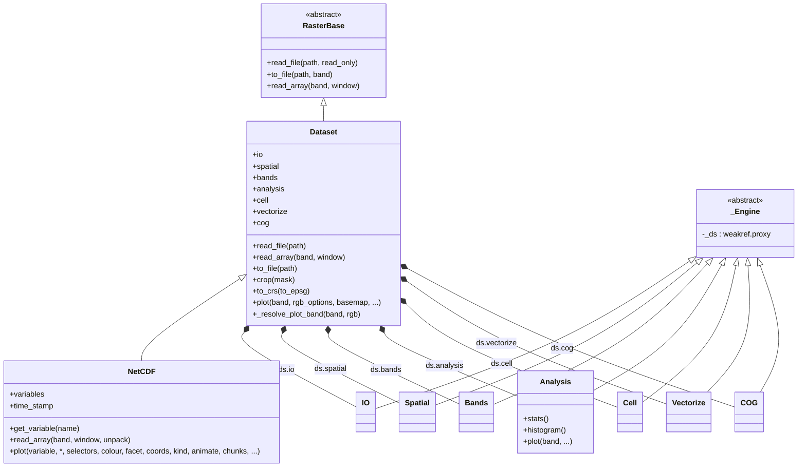

## UML Class: Plotting layer

`Dataset.plot` / `NetCDF.plot` / `DatasetCollection.plot` / `UgridDataset.plot` are thin facades.
The shared `pyramids.dataset._plot_helpers` module owns the cleopatra dispatch (`render_array` for
arrays, `mesh_render` for meshes); `pyramids.netcdf._plot.NetCDFPlot` does the NetCDF-specific
variable/selector/curvilinear/facet/animate resolution and feeds `render_array`; `Selectors` /
`ColourOpts` / `FacetSpec` (in `pyramids.netcdf.plot_options`, re-exported from
`pyramids.netcdf`) are the grouped option dataclasses; `pyramids.basemap.add_basemap` is a thin
wrapper over `cleopatra.tiles.add_tiles`.

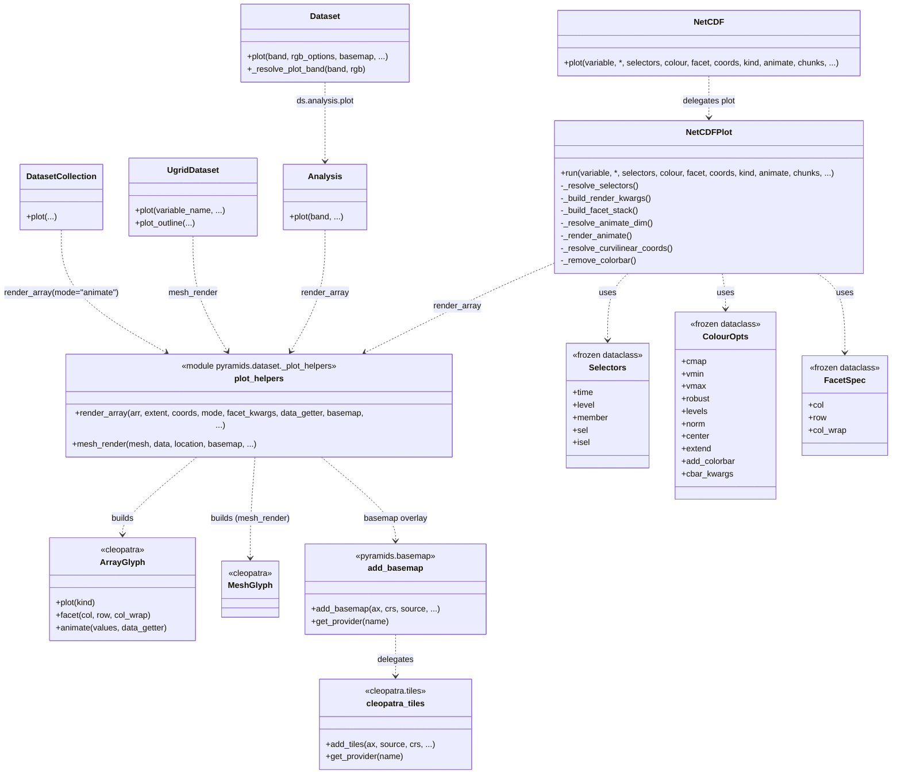

## UML Class: Vector Core

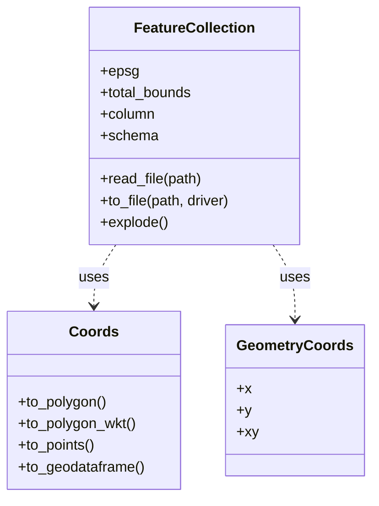

## Sequence: Read Raster from Zip

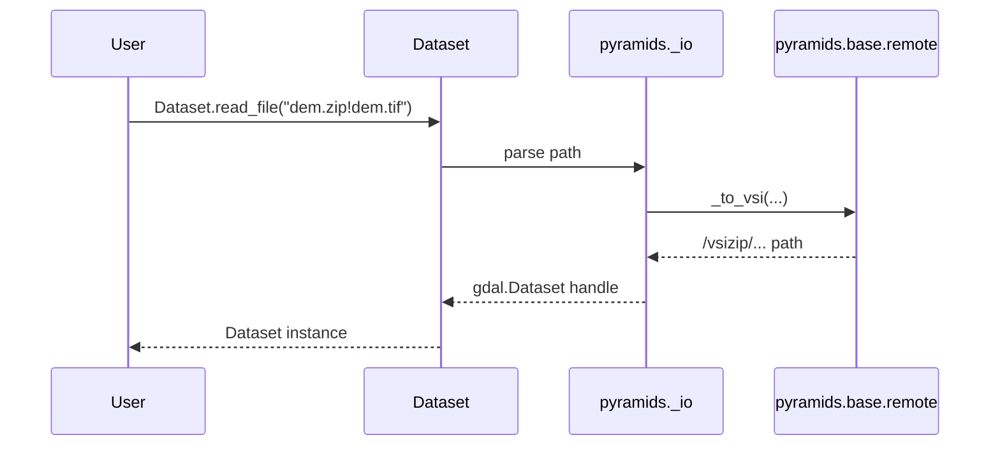

## Sequence: Crop via the Spatial engine

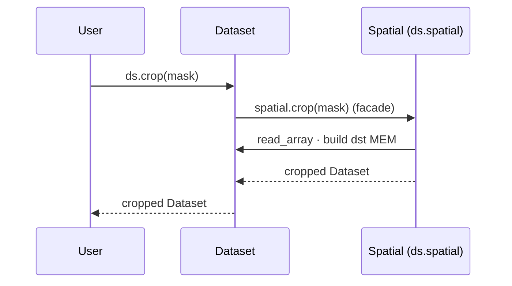

## Sequence: Save Raster to GeoTIFF / COG

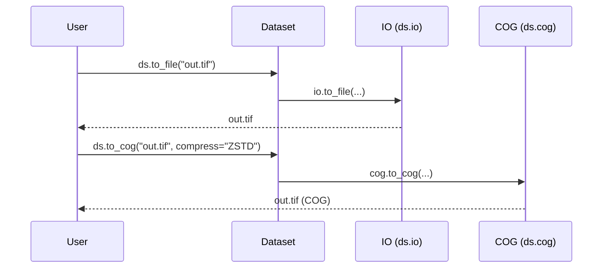

## Sequence: Build DatasetCollection from a Folder

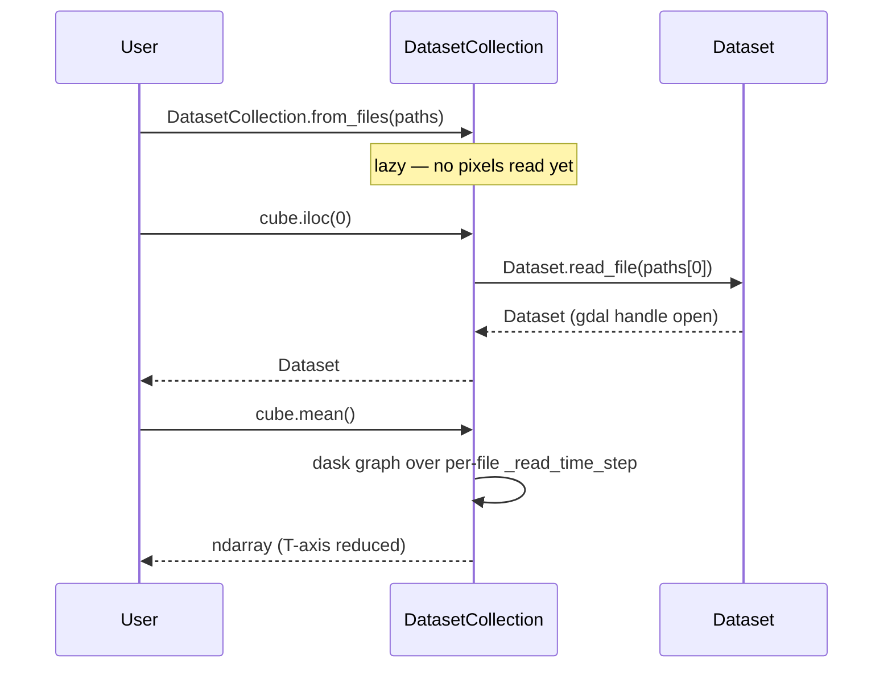

## Sequence: Zonal Statistics

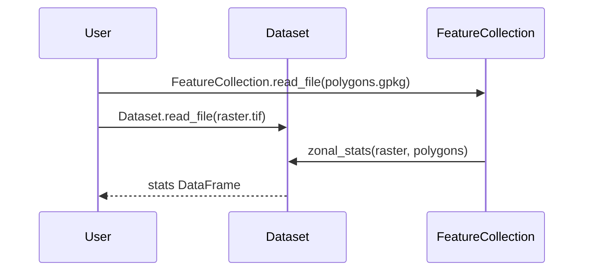

## Sequence: Reproject (maintain_alignment=True)

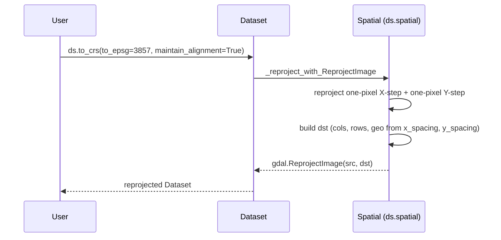

## Dependency Graph (Modules)

An arrow `X --> Y` reads "module `X` is imported by `Y`".

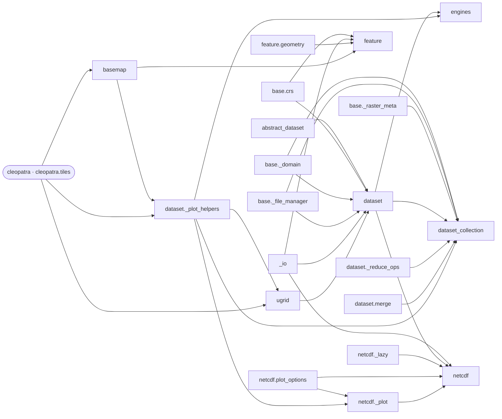

## Detailed Class Diagram

```mermaid
classDiagram
    %% configuration class
    class config_Config {
        +__init__(config_file)
        +load_config()
        +initialize_gdal()
        +set_env_conda()
        +dynamic_env_variables()
        +setup_logging()
    }

    %% abstract base class for rasters
    class abstract_dataset_RasterBase {
        +__init__(src, access)
        +__str__()
        +__repr__()
        +access
        +raster
        +rows · columns · shape
        +geotransform
        +top_left_corner
        +epsg · crs
        +cell_size
        +no_data_value
        +meta_data
        +block_size
        +file_name
        +driver_type
        +read_file(path, read_only)
        +read_array(band, window)
        +plot(...)
    }

    %% concrete raster class
    class dataset_Dataset {
        +__init__(src, access)
        +io · spatial · bands · analysis
        +cell · vectorize · cog
        +read_file(path)
        +create_from_array(arr, top_left_corner, cell_size, epsg)
        +create_from_array(arr, geo, epsg)
        +read_array(band, window)
        +to_file(path, driver)
        +to_cog(path, ...)
        +is_cog
        +validate_cog()
        +to_crs(to_epsg, method, maintain_alignment)
        +resample(cell_size, method)
        +align(alignment_src)
        +crop(mask, touch)
        +apply(ufunc)
        +overlay(classes_map, exclude_value)
        +plot(band, rgb_options, basemap, ...)
        +_resolve_plot_band(band, rgb)
    }

    %% NetCDF: raster class specialised for NetCDF variables
    class netcdf_NetCDF {
        +__init__(src, access, open_as_multi_dimensional)
        +lon · lat · x · y
        +variables · get_variable(name)
        +no_data_value
        +file_name · time_stamp
        +read_file(path, read_only, open_as_multi_dimensional)
        +read_array(band, window, unpack, chunks)
        +get_variable_names()
        +get_variables(read_only)
        +is_subset · is_md_array
        +create_from_array(arr, geo, ...)
        +add_variable(dataset, variable_name)
        +remove_variable(variable_name)
        +plot(variable, *, selectors, colour, facet, coords, kind, animate, chunks, ...)
    }

    %% UgridDataset
    class ugrid_UgridDataset {
        +__init__(src)
        +mesh · n_face
        +data_variable_names
        +read_file(path)
        +create_from_arrays(...)
        +to_dataset(...)
        +to_geodataframe()
        +plot(variable_name, ...)
        +plot_outline(...)
    }

    %% DatasetCollection: lazy temporal stack
    class collection_DatasetCollection {
        +__init__(src, time_length, files, datasets, meta)
        +base · files · time_length · shape
        +datasets · data
        +iloc(i) · __getitem__ · __setitem__
        +head · tail · first · last
        +mean · sum · min · max · std · var
        +groupby(labels)
        +crop · to_crs · align · apply
        +to_file · to_zarr · to_kerchunk · merge
        +plot(...)
    }

    %% Plotting layer (shared cleopatra dispatch + NetCDF resolver + option dataclasses)
    class plot_helpers_module {
        <<module pyramids.dataset._plot_helpers>>
        +render_array(arr, extent, coords, mode, facet_kwargs, data_getter, basemap, ...)
        +mesh_render(mesh, data, location, basemap, ...)
    }
    class netcdf_NetCDFPlot {
        +run(variable, *, selectors, colour, facet, coords, kind, animate, chunks, ...)
        -_resolve_selectors()
        -_build_render_kwargs()
        -_build_facet_stack()
        -_resolve_animate_dim()
        -_render_animate()
        -_resolve_curvilinear_coords()
        -_remove_colorbar()
    }
    class netcdf_Selectors {
        <<frozen dataclass>>
        +time · level · member · sel · isel
    }
    class netcdf_ColourOpts {
        <<frozen dataclass>>
        +cmap · vmin · vmax · robust · levels
        +norm · center · extend · add_colorbar · cbar_kwargs
    }
    class netcdf_FacetSpec {
        <<frozen dataclass>>
        +col · row · col_wrap
    }
    class basemap_module {
        <<module pyramids.basemap>>
        +add_basemap(ax, crs, source, ...)
        +get_provider(name)
    }
    class cleopatra_pkg {
        <<external cleopatra>>
        +ArrayGlyph.plot(kind) · ArrayGlyph.facet() · ArrayGlyph.animate(data_getter)
        +MeshGlyph
        +styles.ColorScale
        +tiles.add_tiles() · tiles.get_provider()
    }

    %% Engines (Dataset collaborators)
    class engines_IO {
        +read_array · _lazy_read_array
        +to_file · to_raster
        +read_overview · get_block_arrangement
        +to_xyz · map_blocks
    }
    class engines_Spatial {
        +to_crs · resample · align
        +crop · _crop_aligned
        +set_crs · _get_epsg
    }
    class engines_Bands {
        +color_table · _get_color_table · _set_color_table
        +_change_no_data_value_attr
        +_check_no_data_value · _set_no_data_value
        +change_no_data_value
        +rats · stats helpers
    }
    class engines_Analysis {
        +stats · count_domain_cells
        +overlay · histogram
        +plot
    }
    class engines_Cell {
        +get_cell_coords · get_cell_polygons · get_cell_points
        +map_to_array_coordinates · array_to_map_coordinates
    }
    class engines_Vectorize {
        +to_feature_collection · translate
        +cluster · to_polygons
    }
    class engines_COG {
        +to_cog · is_cog · validate_cog
    }

    %% FeatureCollection for vector data
    class feature_FeatureCollection {
        +__init__(gdf)
        +epsg · total_bounds · top_left_corner
        +column · schema · file_name
        +read_file(path)
        +to_file(path, driver)
        +explode()
        +to_dataset(...)
    }
    class feature_Coords {
        +to_polygon()
        +to_polygon_wkt()
        +to_points()
        +to_geodataframe()
    }
    class feature_GeometryCoords {
        +x
        +y
        +xy
    }

    %% inheritance relations
    abstract_dataset_RasterBase <|-- dataset_Dataset
    dataset_Dataset <|-- netcdf_NetCDF

    %% engine composition
    dataset_Dataset *-- engines_IO : ds.io
    dataset_Dataset *-- engines_Spatial : ds.spatial
    dataset_Dataset *-- engines_Bands : ds.bands
    dataset_Dataset *-- engines_Analysis : ds.analysis
    dataset_Dataset *-- engines_Cell : ds.cell
    dataset_Dataset *-- engines_Vectorize : ds.vectorize
    dataset_Dataset *-- engines_COG : ds.cog

    %% other relations
    collection_DatasetCollection o-- dataset_Dataset : per-timestep
    ugrid_UgridDataset ..> dataset_Dataset : interpolate
    feature_FeatureCollection ..> dataset_Dataset : rasterize
    dataset_Dataset ..> feature_FeatureCollection : vectorize
    feature_FeatureCollection ..> feature_Coords : uses
    feature_FeatureCollection ..> feature_GeometryCoords : uses
    config_Config ..> dataset_Dataset : initialises GDAL settings

    %% plotting layer relations
    netcdf_NetCDF ..> netcdf_NetCDFPlot : delegates plot()
    netcdf_NetCDFPlot ..> netcdf_Selectors : uses
    netcdf_NetCDFPlot ..> netcdf_ColourOpts : uses
    netcdf_NetCDFPlot ..> netcdf_FacetSpec : uses
    netcdf_NetCDFPlot ..> plot_helpers_module : render_array
    engines_Analysis ..> plot_helpers_module : render_array
    collection_DatasetCollection ..> plot_helpers_module : render_array(mode="animate")
    ugrid_UgridDataset ..> plot_helpers_module : mesh_render
    feature_FeatureCollection ..> basemap_module : add_basemap
    plot_helpers_module ..> basemap_module : basemap overlay
    plot_helpers_module ..> cleopatra_pkg : ArrayGlyph / MeshGlyph
    basemap_module ..> cleopatra_pkg : cleopatra.tiles
```
