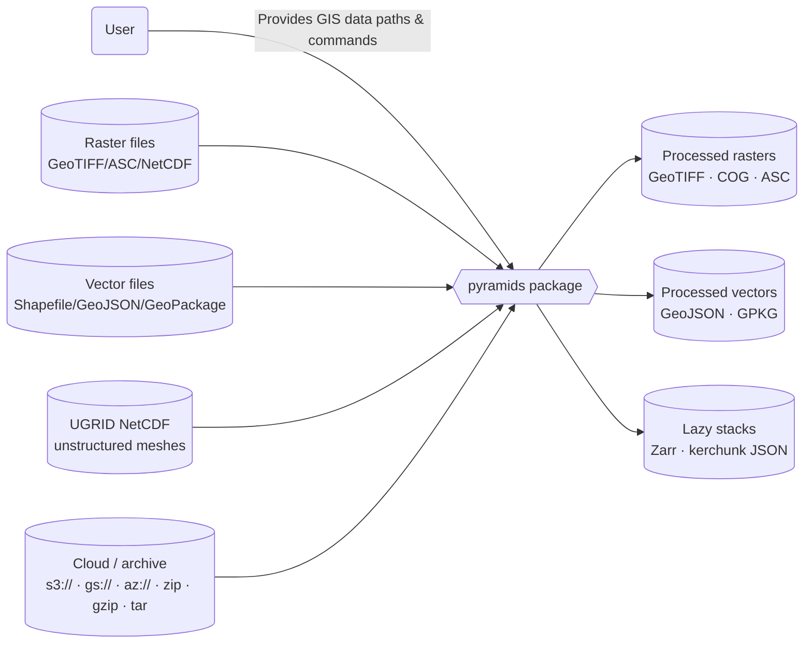
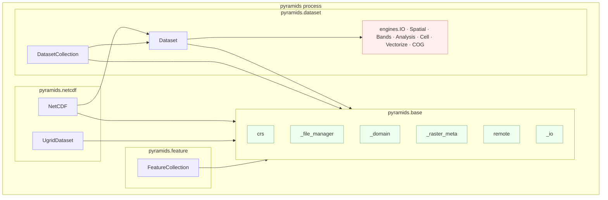
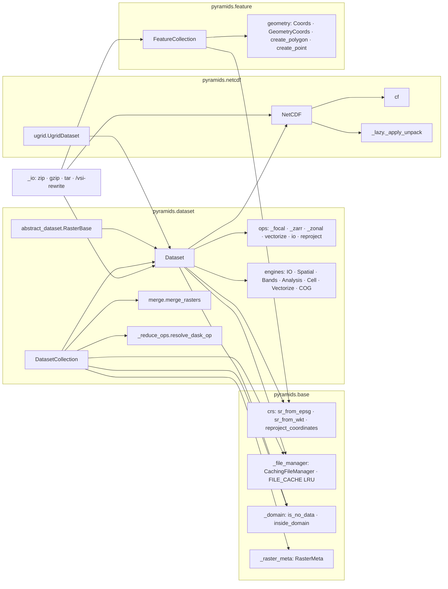

# How it works

This overview explains the system boundaries and data flow of the pyramids package.

## System Context (C4: Context)

## Runtime Containers (C4: Containers)

## Components (C4: Components)

## Data Flow

1. Input paths are normalised — archives (`.zip`/`.gz`/`.tar`) and remote
   URLs (`s3://`, `gs://`, `az://`, `http(s)://`) are rewritten to GDAL
   virtual filesystem paths in `pyramids._io` /
   `pyramids.base.remote`.
2. Raster inputs become `Dataset` (GeoTIFF, ASC) / `NetCDF` (NetCDF, HDF5) /
   `UgridDataset` (UGRID NetCDF) instances; vector inputs become
   `FeatureCollection`. Each concrete class composes engines for its
   public-API families (`ds.spatial`, `ds.io`, …).
3. `DatasetCollection` wraps `N` co-registered `Dataset` instances into a
   lazy `(T, B, R, C)` dask cube. Per-timestep ops (`crop`, `to_crs`,
   `align`, `apply`) loop the per-step gdal handles; time-axis reductions
   (`mean / sum / std / groupby`) run through `_reduce_ops.resolve_dask_op`
   with optional `flox` acceleration.
4. Results are exported via `to_file` (GeoTIFF / ASCII), `to_cog` (COG),
   `to_zarr` (chunked + metadata), `to_kerchunk` (NetCDF/HDF5 sidecar),
   `merge` (mosaic), or vectorized into `FeatureCollection`.

See the diagrams page for UML and sequence flows.
