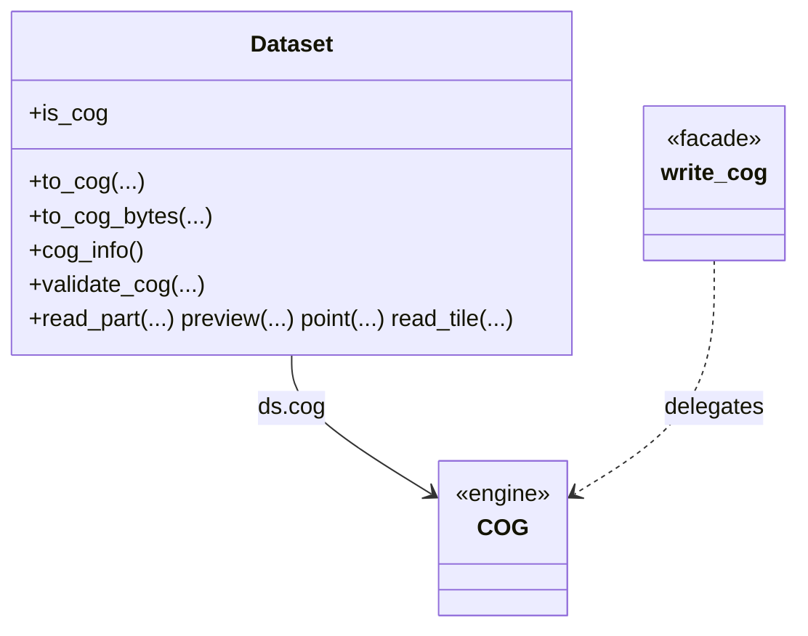

# Cloud Optimized GeoTIFF (COG)

The COG surface lets you **write**, **inspect**, **validate**, and **partially read** Cloud
Optimized GeoTIFFs. It is **GDAL-native** — no extra third-party dependency — and is split
between a small subpackage of helpers (`pyramids.dataset.cog`) and the `COG` engine that
owns the user-facing `Dataset` methods.

## Module layout

`Dataset.to_cog(...)` is the single owner of write policy; the multi-input
`write_cog(...)` facade (NumPy array / `xarray.DataArray` / `gdal.Dataset` / path /
`Dataset`) normalises its input and delegates to it, so both produce identical output.

## Public API at a glance

| Concern | Symbol | Page |
|---------|--------|------|
| Write a COG (typed kwargs) | `Dataset.to_cog` | this page |
| Write from array/DataArray/path | `write_cog` | this page |
| Encode to in-memory bytes | `Dataset.to_cog_bytes` | this page |
| Named compression profiles | `PROFILES` · `profile_options` · `validate_profile` | this page |
| Creation-option helpers | `merge_options` · `to_gdal_options` · `validate_blocksize` | this page |
| Structured inspection | `cog_info` · `COGInfo` · `OverviewLevel` | [Read & inspect](read.md) |
| Validate | `validate` · `ValidationReport` · `Dataset.is_cog` | [Read & inspect](read.md) |
| Overview-decimated reads | `read_part` · `preview` · `point` · `read_tile` | [Read & inspect](read.md) |
| Command line | `pyramids cog create\|validate\|info` | [CLI](cli.md) |

See the [COG cookbook](../../tutorials/cog.md) for an end-to-end walkthrough and the
[COG basics notebook](../../examples/cog/cog-basics.ipynb) for a runnable, offline example.

## Defaults

`to_cog` resolves the two pixel-affecting options per source dtype: the **predictor** (`2`
for integer, `3` for float) and the **overview resampling** (`mode` for categorical sources
— integer dtype or a colour table — and `average` for continuous float). Both can be
overridden explicitly.

## Writing

::: pyramids.dataset.engines.cog.COG
    options:
        show_root_heading: true
        show_source: true
        heading_level: 3
        members_order: source
        filters: ["to_cog", "to_cog_bytes"]

## The `write_cog` facade

::: pyramids.dataset.cog.facade.write_cog
    options:
        show_root_heading: true
        show_source: true
        heading_level: 3

## Creation options & profiles

::: pyramids.dataset.cog.options
    options:
        show_root_heading: true
        show_source: true
        heading_level: 3
        members_order: source
        filters: ["PROFILES", "profile_options", "validate_profile", "merge_options",
            "to_gdal_options", "validate_blocksize", "validate_option_keys",
            "COG_DRIVER_OPTIONS", "COG_READ_DEFAULTS"]
