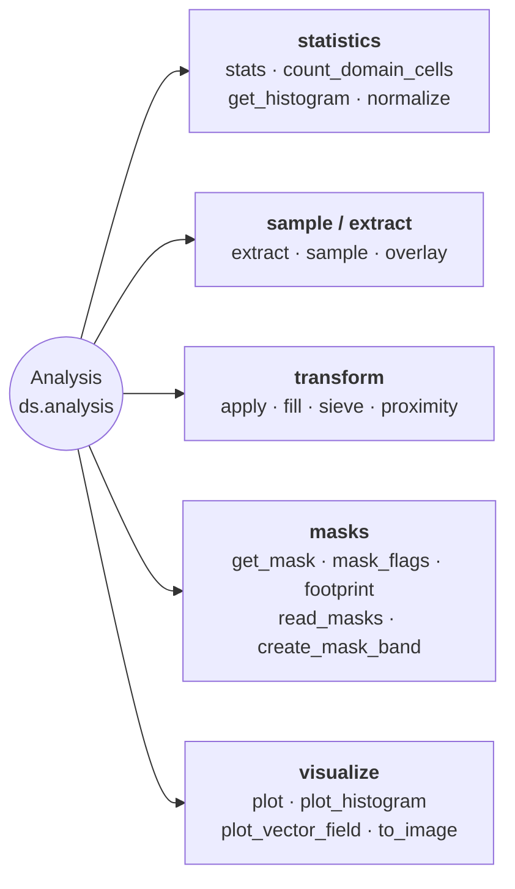

# Analysis & Statistics

Statistics, extraction, overlay, apply, fill, histogram, and plotting.



## Lazy per-pixel operations

Every neighbourhood op on `Dataset` accepts a `chunks=` kwarg that
routes through `dask.array.map_overlap`:

```python
from pyramids.dataset import Dataset

dem = Dataset.read_file("dem.tif")

slope_eager = dem.slope()                          # numpy array (default)
slope_lazy  = dem.slope(chunks=(1024, 1024))       # dask.array.Array
```

| Method                                  | Dask path gated on `chunks=`            |
|-----------------------------------------|-----------------------------------------|
| `ds.focal_mean`                         | Yes                                     |
| `ds.focal_std`                          | Yes (two-pass numerically stable)       |
| `ds.focal_apply(func, ...)`             | Yes (user kernel)                       |
| `ds.slope`, `ds.aspect`, `ds.hillshade` | Yes                                     |
| `ds.zonal_stats(fc, ...)`               | Eager FC required — call `.compute()`   |

See [Lazy rasters](../../tutorials/lazy/lazy-raster.md#neighborhood-ops-focal_-slope-aspect-hillshade)
for chunk-size rules and kernel examples. `zonal_stats` is covered in
its own [section](../../tutorials/lazy/lazy-raster.md#zonal-statistics-datasetzonal_stats).

::: pyramids.dataset.engines.Analysis
    options:
        show_root_heading: true
        show_source: true
        heading_level: 3
        members_order: source
