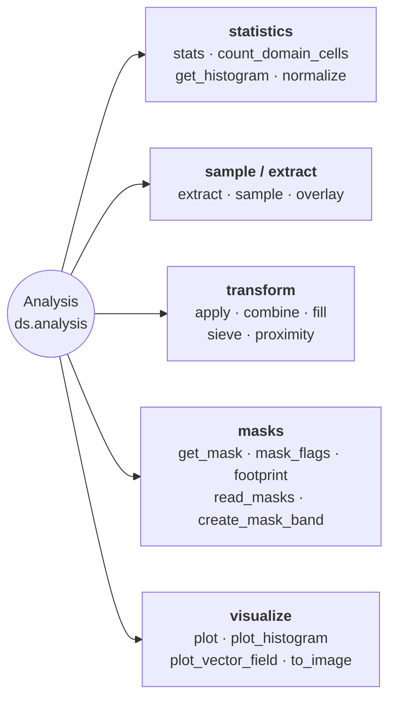

# Analysis & Statistics

Statistics, extraction, overlay, apply, combine, fill, histogram, and plotting.



## Combining two rasters

`apply` transforms one raster; `combine` is its binary counterpart. It runs a
two-argument function over the matching cells of two rasters and hands back a
`Dataset` on the left operand's grid, so a difference never leaves the
`Dataset` and the georeferencing is never rebuilt by hand:

```python
from pyramids.dataset import Dataset

surface = Dataset.read_file("copernicus_glo30.tif")   # surface elevation
bare = Dataset.read_file("fabdem.tif")                # bare-earth elevation

canopy = surface.combine(bare, lambda a, b: a - b)
canopy = surface - bare                               # the same call
```

`-`, `+`, `*` and `/` between two rasters are thin wrappers over `combine`. A
scalar operand is *not* accepted — `ds * 2` stays with `apply`, which keeps the
band's dtype, so the two spellings of one expression cannot disagree about it.

The operands must already share a grid; `combine` never resamples. Use
[`align`](spatial.md) first when they do not, and
`ds.same_grid(other)` to ask before trying:

```python
if not surface.same_grid(bare):
    bare = bare.align(surface)
canopy = surface - bare
```

| Question                                | Answer                                                              |
|-----------------------------------------|---------------------------------------------------------------------|
| Grids differ?                            | `AlignmentError` — call `align()` yourself, no implicit resampling  |
| Cell is no-data in one operand?          | No-data in the result (the domains intersect)                        |
| Result sentinel?                         | `NaN` for a float result, else the left operand's — or `no_data_value=` |
| Result dtype?                            | Whatever `func` returns; `int / int` gives floats, not a truncation |
| Band count?                              | All bands by default; `band=` picks one from each operand           |

The shell equivalent for N rasters is `pyramids calc "(A - B) / (A + B)" a.tif b.tif out.tif`,
which applies the same rule: the inputs must already share a grid.

## Lazy per-pixel operations

Every neighbourhood op on `Dataset` accepts a `chunks=` kwarg that
routes through `dask.array.map_overlap`:

```python
from pyramids.dataset import Dataset

dem = Dataset.read_file("dem.tif")

slope_eager = dem.slope()                          # numpy array (default)
slope_lazy  = dem.slope(chunks=(1024, 1024))       # dask.array.Array
```

| Method                                  | Dask path gated on `chunks=`            |
|-----------------------------------------|-----------------------------------------|
| `ds.focal_mean`                         | Yes                                     |
| `ds.focal_std`                          | Yes (two-pass numerically stable)       |
| `ds.focal_apply(func, ...)`             | Yes (user kernel)                       |
| `ds.slope`, `ds.aspect`, `ds.hillshade` | Yes                                     |
| `ds.zonal_stats(fc, ...)`               | Eager FC required — call `.compute()`   |

See [Lazy rasters](../../tutorials/lazy/lazy-raster.md#neighborhood-ops-focal_-slope-aspect-hillshade)
for chunk-size rules and kernel examples. `zonal_stats` is covered in
its own [section](../../tutorials/lazy/lazy-raster.md#zonal-statistics-datasetzonal_stats).

::: pyramids.dataset.engines.Analysis
    options:
        show_root_heading: true
        show_source: true
        heading_level: 3
        members_order: source
