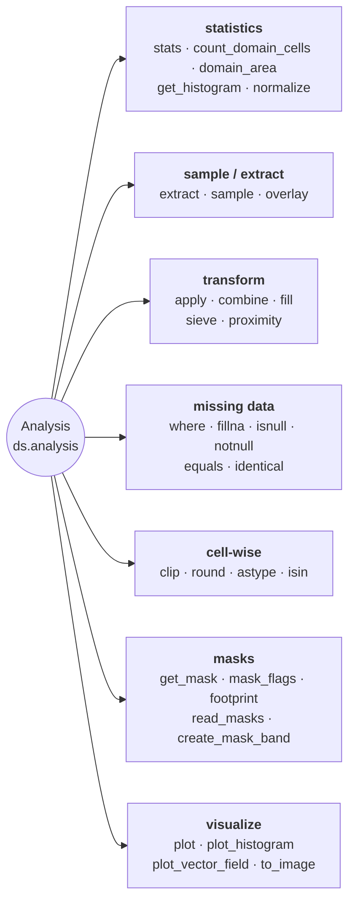

# Analysis & Statistics

Statistics, extraction, overlay, apply, combine, fill, histogram, and plotting.



## Combining two rasters

`apply` transforms one raster; `combine` is its binary counterpart. It runs a
two-argument function over the matching cells of two rasters and hands back a
`Dataset` on the left operand's grid, so a difference never leaves the
`Dataset` and the georeferencing is never rebuilt by hand:

```python
from pyramids.dataset import Dataset

surface = Dataset.read_file("copernicus_glo30.tif")   # surface elevation
bare = Dataset.read_file("fabdem.tif")                # bare-earth elevation

canopy = surface.combine(bare, lambda a, b: a - b)
canopy = surface - bare                               # the same call
```

`-`, `+`, `*` and `/` are thin wrappers over `combine`, and accept either another
raster or a real scalar on either side: `ds * 2`, `2 * ds`, `20 - ds` and `ds >= 5`
all work. A scalar takes the same route as a raster operand, with the constant
folded into the callable, so `ds * 2` and `ds * other` agree on band count, dtype
and sentinel — including the integer wraparound the warning below describes.

That is deliberately *not* the same as `ds.apply(lambda v: v * 2)`. `apply`
transforms one band and keeps the source's sentinel; `combine` spans every band
and derives one (`NaN` for a floating result). The two are different tools, and
the operator matches the operator family — `ds * 2` and `ds * other` are the same
syntax and should not mean different things. Reach for `apply` when you want its
single-band, sentinel-preserving contract.

`bool` and complex scalars are still refused: `True` is a `Real` equal to `1`, so
`ds * True` succeeding would read as a caller's bug, and no band holds an
imaginary part.

`nan` and `inf` are **not** refused, and `ds * float("nan")` is the one scalar
that quietly empties a raster: every cell computes to `nan`, a floating result
takes `nan` as its sentinel, and what comes back reads as entirely no-data to
every consumer. `ds * float("inf")` stores infinities the same way. That is what
the arithmetic says, so neither is second-guessed — but a non-finite scalar is
almost always an uninitialised variable rather than an intention. Check the
scalar before applying it if it came from a computation.

The operands must already share a grid; `combine` never resamples. Use
[`align`](spatial.md) first when they do not, and
`ds.same_grid(other)` to ask before trying:

```python
if not surface.same_grid(bare):
    bare = bare.align(surface)
canopy = surface - bare
```

| Question                                | Answer                                                              |
|-----------------------------------------|---------------------------------------------------------------------|
| Grids differ?                            | `AlignmentError` — call `align()` yourself, no implicit resampling  |
| Cell is no-data in one operand?          | No-data in the result (the domains intersect)                        |
| Result sentinel?                         | Derived against the computed values — see below — or `no_data_value=` |
| Result dtype?                            | Whatever `func` returns; `int / int` gives floats, not a truncation |
| Integer overflow?                        | Wraps, as numpy does — see the warning below                        |
| Band count?                              | All bands by default; `band=` picks one from each operand           |

!!! warning "Integer arithmetic wraps"

    The result takes whatever dtype `func` returns, which for two integer bands
    is that same integer dtype — with numpy's wraparound, not an error and not a
    promotion. On `uint8`, `10 - 20` is `246`; on `int16`, `30000 - (-30000)` is
    `-5536`. Nothing marks those cells: an integer result that masked nothing
    declares no sentinel, so they read as ordinary data.

    **A scalar operand wraps the same way**, because it takes the same route.
    `byte_ds * 2` is `144` wherever the band held `200`, and `byte_ds + 5` is
    `255` wherever it held `250`. Those cells are ordinary **data**, not gaps:
    the sentinel is derived against the values just computed, so a result that
    holds `255` cannot also claim it — the raster comes back declaring no
    sentinel at all when nothing was masked, and some other free value when
    something was. Nothing marks a wrapped cell. A scalar too wide for the
    band's dtype is numpy's error verbatim: `byte_ds + 300` raises
    `OverflowError: Python integer 300 out of bounds for uint8`.

    This bites hardest on the difference this page leads with. Promote before
    subtracting when the operands are integers and the answer can go negative or
    overflow:

    ```python
    canopy = surface.combine(bare, lambda a, b: a.astype("int32") - b)
    canopy = surface.combine(bare, lambda a, b: a.astype("float32") - b)
    scaled = byte_ds.combine(byte_ds, lambda v, _: v.astype("int16") * 2)
    ```

### How the result's no-data value is chosen

A sentinel is a real value of the band's dtype, so the only question that matters
is whether `func` also computed it. `uint8` `200 + 55` lands exactly on `255` —
the sentinel every `uint8` band gets by default — and `int32` `0 - 9999` lands on
the package default, so inheriting an operand's sentinel blind would hand back a
raster every consumer reads as empty. `combine` therefore derives the sentinel
*from the values it just computed*:

* a **floating** result always takes `NaN`. It is *not* checked against the values,
  and does not need to be: `NaN` is not a measurement, so a cell `func` computed as
  `NaN` — `0/0` in a normalised difference, `log` of a negative — genuinely has no
  value, and the result marking it a gap is the right answer rather than a
  collision. `count_domain_cells()` on the result will be lower than on the inputs
  when that happens;
* a **predicate** (`a > b`) is stored as Byte and takes `255`, free beside `0`/`1`;
* an **integer** result that masked nothing declares **no sentinel** — there is no
  gap to mark, and any in-range value would be a lie;
* an **integer** result that masked something takes the first value that both fits
  the dtype and occurs nowhere in the result, searched through the operands' own
  sentinels (every band, left operand first), then `-9999`, then the dtype's
  extremes — max before min for an unsigned dtype, whose min is the very usable `0`.
  For the narrow integer widths (`int8`, `uint8`, `int16`, `uint16`) the search does
  not stop there: the rest of the range is enumerated and the first unused value
  taken, walking inward from the preferred extreme, so a result holding every
  candidate still gets an answer. `int32` and wider refuse once the candidates are
  exhausted, their ranges being too large to enumerate and a collision on all of
  them correspondingly unlikely.

An explicit `no_data_value=` is always honoured, with a `NoDataCollisionWarning`
when the result holds it. `no_data_value=None` turns masking off entirely: every
cell reaches `func`, including the ones the inputs marked as no-data.

### Summing more than two

`sum(rasters)` works. It seeds its accumulator with the integer `0`, which
`__radd__` absorbs as the additive identity — returning a *copy*, so summing a
one-element list never aliases its input:

```python
from functools import reduce
import operator

total = sum(rasters)                       # a fresh Dataset
total = sum(rasters[1:], start=rasters[0]) # the same, for two or more
total = reduce(operator.add, rasters)      # the same, for two or more
```

For a *one*-element list they differ: `sum([a])` returns a copy while
`reduce(operator.add, [a])` returns `a` itself, so an in-place write to "the
total" would reach into the input.

`math.prod(rasters)` folds the same way, absorbing the integer `1`.

A wrapper that forwards `no_data_value` should accept it in `**kwargs` and pass
the whole mapping on, rather than naming a default of its own — the "derive it"
default is a private sentinel, and `**kwargs` forwards it without spelling it.

Adding zero, multiplying by one and subtracting zero short-circuit to a `copy()`
rather than computing — the first two on **either** side, the third on the right
only, since `0 - ds` negates. Two reasons: `sum()` and `math.prod()` seed their
accumulators with those identities and a one-element fold should keep the
source's sentinel; and a no-op must not change the raster. Routed through
`combine`, `ds + 0.0` would widen an `int16` band to `float64` where `0.0 + ds`
is a byte-identical copy, and `ds + 0` would *drop* the declared no-data value —
because an integer result that masked nothing declares no sentinel — so a
no-op would strip the no-data tag off a raster on its way to disk.

`ds / 1` is **not** absorbed, and is the one right identity that is not: true
division widens an integer band to `float64` as it does everywhere else in
numpy, so short-circuiting it would make `ds / 1` the one division that does
not widen. It computes, and the result declares `NaN`.

Every other real scalar computes through `combine`. `False + ds` and `0j + ds`
still raise. "Real" is `numbers.Real`, so `Fraction(0)` and every numpy float or
int zero are absorbed while `Decimal(0)` — which registers as `Number` but not
`Real` — is not.

A `Real` NumPy cannot put in a band — a `Fraction`, say — is converted to
`float` before it is applied, because NumPy resolves an expression against one
to an object-dtype array that has no GDAL band type. `int`, `float` and the
numpy scalar types are left exactly as written, so `ds * 2` stays an integer
multiply rather than widening to `float64`.

**A numpy scalar carries its own dtype into the result; a Python one does not.**
That is NEP 50's weak promotion, and it decides the width of the band you get:
on a `float32` raster, `ds * 2` and `ds * 2.0` both stay `float32`, while
`ds * np.float64(2)` comes back `float64` — twice the bytes for the same
arithmetic. Write the plain Python spelling unless the wider band is what you
want.

!!! warning "Three things to know before folding with `sum()`"

    * **`sum([])` is the integer `0`,** not a raster. A fold over a glob that
      matched nothing fails later, wherever the result is first used as a raster.
    * **One raster is not like several.** A one-element fold never reaches
      `combine`, so it keeps the source's own no-data value; two or more take
      `combine`'s derived sentinel (`NaN` for a floating result). `sum()` has no
      way to pass `no_data_value=` through, so if the sentinel must be stable
      whatever the file count, fold with
      `reduce(partial(Dataset.combine, func=operator.add, no_data_value=...), rasters)`
      instead of `sum()`.
    * **`sum()` costs one extra raster copy** that `reduce(operator.add, ...)`
      does not — the identity step duplicates the first operand. That matters
      near the memory limit described below.

### Comparing two rasters

`<`, `<=`, `>` and `>=` between two rasters give a mask, since a comparison
between rasters is itself a raster:

```python
taller = surface >= bare        # Dataset, uint8: 1 where it holds, 0 where not
```

GDAL has no boolean band type, so the mask is stored as Byte and declares `255`
as its no-data value — a cell that was no-data in *either* operand comes back
`255` rather than a `0` that would read as "the test failed here".

`==` and `!=` are deliberately **not** overridden. They stay identity-based, so
`Dataset` keeps working in `assert a == b`, in sets and as a dict key — ask for
`a.combine(b, np.equal)` when you want the mask.

### A raster has no truth value

`bool(ds)` raises, for every raster — the same choice numpy, pandas and xarray
make for their array types:

```python
if surface >= bare:          # ValueError — a comparison is a raster, not a yes/no
if ds:                       # ValueError — use `ds is not None`
if bool(np.asarray((surface >= bare).read_array()).all()):   # the actual question
```

`sorted`, `min` and `max` over **two or more** rasters raise for the same reason:
they compare internally, then reduce the result. (A one-element sequence compares
nothing and still succeeds, and a misaligned pair raises `AlignmentError` from
the comparison before truthiness is ever reached.)

A narrower rule — refuse only for rasters a comparison produced — was tried and
withdrawn. The marker could not be carried correctly: it was lost by `copy`,
`crop`, `to_crs`, `align`, `resample`, a `to_file`/`read_file` round trip and by
pickling, so the hazard returned after one operation; and it survived
`apply(inplace=True)` and `write_array`, so a raster holding ordinary
measurements began refusing. A property that cannot be propagated correctly is
worse than no property.

`Dataset` is deliberately **not an ordered type**: `a < b` yields a raster while
`a == b` yields a `bool`, so `not (a < b)` raises where `a >= b` does not. Use
the operators to build masks, never to order rasters.

### The shell equivalent

`pyramids calc "(A - B) / (A + B)" a.tif b.tif out.tif` is the same operation for N
rasters from a shell. It shares the grid rule — the inputs must already share a grid
— but not the domain semantics: `calc` evaluates over the raw arrays, so no-data
cells take part in the arithmetic, and it broadcasts mismatched band counts instead
of refusing them.

### Memory

`combine` is a whole-array operation — both operands are read in full, and peak
usage is several times one band. There is no tiled or lazy path yet, so for
rasters near the memory limit reach for `apply(elementwise=True)` (single-raster,
streamed) or `read_array(chunks=)` and dask.

## Missing data and comparison

Six members answer the everyday questions about a raster's gaps, spelled as xarray spells them so the
habit transfers. All six are on `Dataset`, so a `NetCDF` variable has them too.

| Member                      | What it does                                                                     |
|-----------------------------|----------------------------------------------------------------------------------|
| `ds.where(cond, other)`     | Keeps the cells `cond` selects and masks the rest; `other` writes a number there. |
| `ds.fillna(value)`          | Writes `value` into every gap, leaving the cells that hold data untouched.        |
| `ds.isnull()`               | `uint8` flags, `1` at each gap and `0` at each cell that holds data.             |
| `ds.notnull()`              | Its complement: `1` at each cell that holds data. Reads as a `where` condition.  |
| `ds.equals(other)`          | Whether two rasters hold the same values on the same grid; a gap equals a gap.    |
| `ds.identical(other)`       | `equals`, and the band names and dataset tags agree too.                          |

```python
from pyramids.dataset import Dataset

dem = Dataset.read_file("dem.tif")

deep = dem.where(dem > 500)                  # the rest become gaps
zeroed = dem.where(dem > 500, 0.0)           # the rest become 0.0
trimmed = dem.where(dem > 500, drop=True)    # and the empty rows/columns go
filled = dem.fillna(0.0)                     # the gaps become 0.0
gaps = dem.isnull()                          # 1 where a cell is missing
dem.equals(dem.copy())                       # True — a method, not `==`
```

`where`'s condition may be a boolean array, another raster on the same grid (which is what a comparison
such as `dem > 500` produces), or a callable handed the physical values. A condition cell that is itself
no-data reads as **false**, which is xarray's answer too. `drop=True` trims by the *condition*, so `other`
does not save a row and a cell that was already missing is kept if the condition selected it.

`equals` and `identical` read the values and the grid, not the declared sentinel or the band type: two
rasters marking the same gaps with `-9999.0` and `-1.0` are identical, as are a `float64` raster and its
`float32` copy. Compare `no_data_value` and `dtype` yourself when those matter.

## Cell-wise transforms

Four members that transform or test each cell, again spelled as xarray spells them and again on `Dataset`,
so a `NetCDF` variable has them too.

| Member                           | What it does                                                             |
|----------------------------------|--------------------------------------------------------------------------|
| `ds.clip(min, max)`              | Bounds the values to `[min, max]`; either bound may be left out.          |
| `ds.round(decimals)`             | Rounds to `decimals` places; halves round to even, as numpy does.         |
| `ds.astype(dtype, no_data_value)`| Changes the band type; the gaps are re-marked for the new type.           |
| `ds.isin(values)`                | `uint8` flags, `1` where a cell's value is one of `values`.               |

```python
from pyramids.dataset import Dataset

dem = Dataset.read_file("dem.tif")
landcover = Dataset.read_file("landcover.tif")

bounded = dem.clip(0.0, 3000.0)                  # below-sea-level cells to 0
metres = dem.round()                             # whole metres
small = dem.clip(0.0, 254.0).astype("uint8", no_data_value=255)  # 255 left free to mark gaps
water = landcover.isin([80, 90])                 # the water classes, as a condition
lakes = landcover.where(water)
```

`astype` refuses a sentinel that any cell already holds once cast — `clip(0.0, 255.0)` with
`no_data_value=255` would clamp every cell at or above 255 onto the sentinel and read them as missing
ever after, which is why the bound above is 254.

**A gap stays a gap in all four.** The gaps are left out of the operation and re-marked afterwards,
because operating on the stored array would turn missing cells into measurements: clipping would lift a
`-9999.0` gap to the lower bound, and rounding turns a `-9999.5` sentinel into `-10000.0`, which no longer
matches what was declared. `isin` flags a gap `0` even when the set holds the gap's own sentinel — it is
missing, not that value.

**`astype` refuses a sentinel the new type cannot hold** rather than letting it wrap into a real value:
`-9999` into `uint8` would become `241`, and every gap would read as data. Pass `no_data_value=` with one
the type does hold. The cells that hold data cast as numpy casts them, and a value outside the target's
range is not refused: numpy leaves an out-of-range float cast undefined (on x86 `300.0` into `uint8` comes
out `44`). `clip` first when that matters, as the example does.

`clip` refuses `min` above `max`, where numpy would quietly set every cell to `max`.

## Lazy per-pixel operations

Every neighbourhood op on `Dataset` accepts a `chunks=` kwarg that
routes through `dask.array.map_overlap`:

```python
from pyramids.dataset import Dataset

dem = Dataset.read_file("dem.tif")

slope_eager = dem.slope()                          # numpy array (default)
slope_lazy  = dem.slope(chunks=(1024, 1024))       # dask.array.Array
```

| Method                                  | Dask path gated on `chunks=`            |
|-----------------------------------------|-----------------------------------------|
| `ds.focal_mean`                         | Yes                                     |
| `ds.focal_std`                          | Yes (two-pass numerically stable)       |
| `ds.focal_apply(func, ...)`             | Yes (user kernel)                       |
| `ds.slope`, `ds.aspect`, `ds.hillshade` | Yes                                     |
| `ds.zonal_stats(fc, ...)`               | Eager FC required — call `.compute()`   |

See [Lazy rasters](../../tutorials/lazy/lazy-raster.md#neighborhood-ops-focal_-slope-aspect-hillshade)
for chunk-size rules and kernel examples. `zonal_stats` is covered in
its own [section](../../tutorials/lazy/lazy-raster.md#zonal-statistics-datasetzonal_stats).

::: pyramids.dataset.engines.Analysis
    options:
        show_root_heading: true
        show_source: true
        heading_level: 3
        members_order: source
