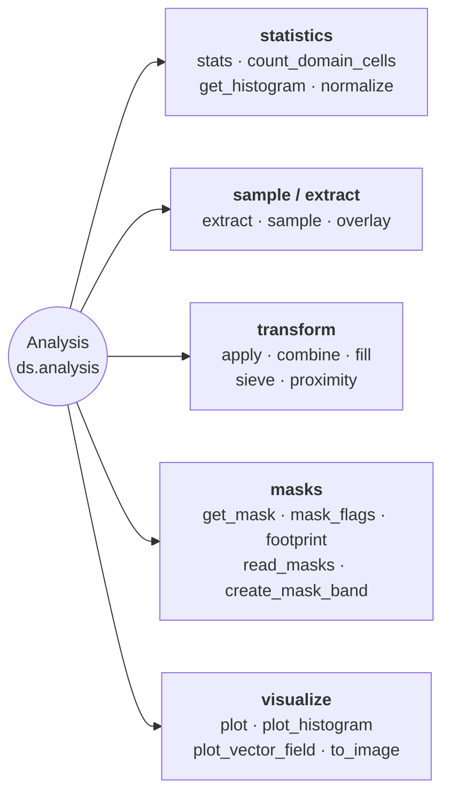

# Analysis & Statistics

Statistics, extraction, overlay, apply, combine, fill, histogram, and plotting.



## Combining two rasters

`apply` transforms one raster; `combine` is its binary counterpart. It runs a
two-argument function over the matching cells of two rasters and hands back a
`Dataset` on the left operand's grid, so a difference never leaves the
`Dataset` and the georeferencing is never rebuilt by hand:

```python
from pyramids.dataset import Dataset

surface = Dataset.read_file("copernicus_glo30.tif")   # surface elevation
bare = Dataset.read_file("fabdem.tif")                # bare-earth elevation

canopy = surface.combine(bare, lambda a, b: a - b)
canopy = surface - bare                               # the same call
```

`-`, `+`, `*` and `/` between two rasters are thin wrappers over `combine`. A
scalar operand is *not* accepted: `ds * 2` raises `TypeError`, and scalar
arithmetic is spelled `ds.apply(lambda v: v * 2)` instead. Keeping the two apart
is deliberate — `apply` preserves the band's dtype while `combine` takes whatever
`func` returns, so one expression written two ways cannot disagree about it.

The operands must already share a grid; `combine` never resamples. Use
[`align`](spatial.md) first when they do not, and
`ds.same_grid(other)` to ask before trying:

```python
if not surface.same_grid(bare):
    bare = bare.align(surface)
canopy = surface - bare
```

| Question                                | Answer                                                              |
|-----------------------------------------|---------------------------------------------------------------------|
| Grids differ?                            | `AlignmentError` — call `align()` yourself, no implicit resampling  |
| Cell is no-data in one operand?          | No-data in the result (the domains intersect)                        |
| Result sentinel?                         | Derived against the computed values — see below — or `no_data_value=` |
| Result dtype?                            | Whatever `func` returns; `int / int` gives floats, not a truncation |
| Band count?                              | All bands by default; `band=` picks one from each operand           |

### How the result's no-data value is chosen

A sentinel is a real value of the band's dtype, so the only question that matters
is whether `func` also computed it. `uint8` `200 + 55` lands exactly on `255` —
the sentinel every `uint8` band gets by default — and `int32` `0 - 9999` lands on
the package default, so inheriting an operand's sentinel blind would hand back a
raster every consumer reads as empty. `combine` therefore derives the sentinel
*from the values it just computed*:

* a **floating** result takes `NaN`, which no arithmetic produces and means as data;
* a **predicate** (`a > b`) is stored as Byte and takes `255`, free beside `0`/`1`;
* an **integer** result that masked nothing declares **no sentinel** — there is no
  gap to mark, and any in-range value would be a lie;
* an **integer** result that masked something takes the first value that both fits
  the dtype and occurs nowhere in the result, searched through the operands' own
  sentinels (every band, left operand first), then `-9999`, then the dtype's
  extremes.

An explicit `no_data_value=` is always honoured, with a `NoDataCollisionWarning`
when the result holds it. `no_data_value=None` turns masking off entirely: every
cell reaches `func`, including the ones the inputs marked as no-data.

### Memory

`combine` is a whole-array operation — both operands are read in full, and peak
usage is several times one band. There is no tiled or lazy path yet, so for
rasters near the memory limit reach for `apply(elementwise=True)` (single-raster,
streamed) or `read_array(chunks=)` and dask.

The shell equivalent for N rasters is `pyramids calc "(A - B) / (A + B)" a.tif b.tif out.tif`.
It shares the grid rule — the inputs must already share a grid — but not the
domain semantics: `calc` evaluates over the raw arrays, so no-data cells take part
in the arithmetic, and it broadcasts mismatched band counts instead of refusing them.

## Lazy per-pixel operations

Every neighbourhood op on `Dataset` accepts a `chunks=` kwarg that
routes through `dask.array.map_overlap`:

```python
from pyramids.dataset import Dataset

dem = Dataset.read_file("dem.tif")

slope_eager = dem.slope()                          # numpy array (default)
slope_lazy  = dem.slope(chunks=(1024, 1024))       # dask.array.Array
```

| Method                                  | Dask path gated on `chunks=`            |
|-----------------------------------------|-----------------------------------------|
| `ds.focal_mean`                         | Yes                                     |
| `ds.focal_std`                          | Yes (two-pass numerically stable)       |
| `ds.focal_apply(func, ...)`             | Yes (user kernel)                       |
| `ds.slope`, `ds.aspect`, `ds.hillshade` | Yes                                     |
| `ds.zonal_stats(fc, ...)`               | Eager FC required — call `.compute()`   |

See [Lazy rasters](../../tutorials/lazy/lazy-raster.md#neighborhood-ops-focal_-slope-aspect-hillshade)
for chunk-size rules and kernel examples. `zonal_stats` is covered in
its own [section](../../tutorials/lazy/lazy-raster.md#zonal-statistics-datasetzonal_stats).

::: pyramids.dataset.engines.Analysis
    options:
        show_root_heading: true
        show_source: true
        heading_level: 3
        members_order: source
