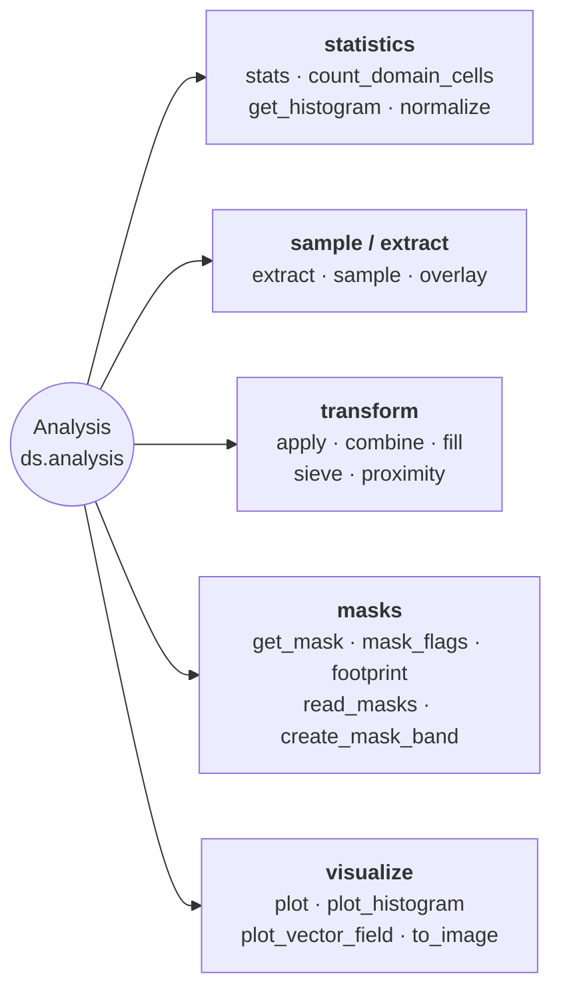

# Analysis & Statistics

Statistics, extraction, overlay, apply, combine, fill, histogram, and plotting.



## Combining two rasters

`apply` transforms one raster; `combine` is its binary counterpart. It runs a
two-argument function over the matching cells of two rasters and hands back a
`Dataset` on the left operand's grid, so a difference never leaves the
`Dataset` and the georeferencing is never rebuilt by hand:

```python
from pyramids.dataset import Dataset

surface = Dataset.read_file("copernicus_glo30.tif")   # surface elevation
bare = Dataset.read_file("fabdem.tif")                # bare-earth elevation

canopy = surface.combine(bare, lambda a, b: a - b)
canopy = surface - bare                               # the same call
```

`-`, `+`, `*` and `/` between two rasters are thin wrappers over `combine`. A
scalar operand is *not* accepted: `ds * 2` raises `TypeError`, and scalar
arithmetic is spelled `ds.apply(lambda v: v * 2)` instead. Keeping the two apart
is deliberate — `apply` preserves the band's dtype while `combine` takes whatever
`func` returns, so one expression written two ways cannot disagree about it.

The operands must already share a grid; `combine` never resamples. Use
[`align`](spatial.md) first when they do not, and
`ds.same_grid(other)` to ask before trying:

```python
if not surface.same_grid(bare):
    bare = bare.align(surface)
canopy = surface - bare
```

| Question                                | Answer                                                              |
|-----------------------------------------|---------------------------------------------------------------------|
| Grids differ?                            | `AlignmentError` — call `align()` yourself, no implicit resampling  |
| Cell is no-data in one operand?          | No-data in the result (the domains intersect)                        |
| Result sentinel?                         | Derived against the computed values — see below — or `no_data_value=` |
| Result dtype?                            | Whatever `func` returns; `int / int` gives floats, not a truncation |
| Band count?                              | All bands by default; `band=` picks one from each operand           |

### How the result's no-data value is chosen

A sentinel is a real value of the band's dtype, so the only question that matters
is whether `func` also computed it. `uint8` `200 + 55` lands exactly on `255` —
the sentinel every `uint8` band gets by default — and `int32` `0 - 9999` lands on
the package default, so inheriting an operand's sentinel blind would hand back a
raster every consumer reads as empty. `combine` therefore derives the sentinel
*from the values it just computed*:

* a **floating** result always takes `NaN`. It is *not* checked against the values,
  and does not need to be: `NaN` is not a measurement, so a cell `func` computed as
  `NaN` — `0/0` in a normalised difference, `log` of a negative — genuinely has no
  value, and the result marking it a gap is the right answer rather than a
  collision. `count_domain_cells()` on the result will be lower than on the inputs
  when that happens;
* a **predicate** (`a > b`) is stored as Byte and takes `255`, free beside `0`/`1`;
* an **integer** result that masked nothing declares **no sentinel** — there is no
  gap to mark, and any in-range value would be a lie;
* an **integer** result that masked something takes the first value that both fits
  the dtype and occurs nowhere in the result, searched through the operands' own
  sentinels (every band, left operand first), then `-9999`, then the dtype's
  extremes — max before min for an unsigned dtype, whose min is the very usable `0`.

An explicit `no_data_value=` is always honoured, with a `NoDataCollisionWarning`
when the result holds it. `no_data_value=None` turns masking off entirely: every
cell reaches `func`, including the ones the inputs marked as no-data.

### Summing more than two

`sum(rasters)` works. It seeds its accumulator with the integer `0`, which
`__radd__` absorbs as the additive identity — returning a *copy*, so summing a
one-element list never aliases its input:

```python
from functools import reduce
import operator

total = sum(rasters)                       # a fresh Dataset
total = sum(rasters[1:], start=rasters[0]) # equivalent
total = reduce(operator.add, rasters)      # equivalent
```

`math.prod(rasters)` folds the same way, absorbing the integer `1`.

A real numeric zero (or one) is the only scalar the operators accept, and only
from the left: `1 + ds`, `False + ds`, `0j + ds` and `ds + 0` all raise, so this
is not a back door into scalar arithmetic. "Real" is `numbers.Real`, so
`Fraction(0)` and every numpy float or int zero are absorbed while `Decimal(0)`
— which registers as `Number` but not `Real` — is not.

!!! warning "Three things to know before folding with `sum()`"

    * **`sum([])` is the integer `0`,** not a raster. A fold over a glob that
      matched nothing fails later, wherever the result is first used as a raster.
    * **One raster is not like several.** A one-element fold never reaches
      `combine`, so it keeps the source's own no-data value; two or more take
      `combine`'s derived sentinel (`NaN` for a floating result). `sum()` has no
      way to pass `no_data_value=` through, so if the sentinel must be stable
      whatever the file count, fold with
      `reduce(partial(Dataset.combine, func=operator.add, no_data_value=...), rasters)`
      instead of `sum()`.
    * **`sum()` costs one extra raster copy** that `reduce(operator.add, ...)`
      does not — the identity step duplicates the first operand. That matters
      near the memory limit described below.

### Comparing two rasters

`<`, `<=`, `>` and `>=` between two rasters give a mask, since a comparison
between rasters is itself a raster:

```python
taller = surface >= bare        # Dataset, uint8: 1 where it holds, 0 where not
```

GDAL has no boolean band type, so the mask is stored as Byte and declares `255`
as its no-data value — a cell that was no-data in *either* operand comes back
`255` rather than a `0` that would read as "the test failed here".

`==` and `!=` are deliberately **not** overridden. They stay identity-based, so
`Dataset` keeps working in `assert a == b`, in sets and as a dict key — ask for
`a.combine(b, np.equal)` when you want the mask.

### A raster has no truth value

`bool(ds)` raises, for every raster — the same choice numpy, pandas and xarray
make for their array types:

```python
if surface >= bare:          # ValueError — a comparison is a raster, not a yes/no
if ds:                       # ValueError — use `ds is not None`
if bool(np.asarray((surface >= bare).read_array()).all()):   # the actual question
```

`sorted`, `min` and `max` over **two or more** rasters raise for the same reason:
they compare internally, then reduce the result. (A one-element sequence compares
nothing and still succeeds, and a misaligned pair raises `AlignmentError` from
the comparison before truthiness is ever reached.)

A narrower rule — refuse only for rasters a comparison produced — was tried and
withdrawn. The marker could not be carried correctly: it was lost by `copy`,
`crop`, `to_crs`, `align`, `resample`, a `to_file`/`read_file` round trip and by
pickling, so the hazard returned after one operation; and it survived
`apply(inplace=True)` and `write_array`, so a raster holding ordinary
measurements began refusing. A property that cannot be propagated correctly is
worse than no property.

`Dataset` is deliberately **not an ordered type**: `a < b` yields a raster while
`a == b` yields a `bool`, so `not (a < b)` raises where `a >= b` does not. Use
the operators to build masks, never to order rasters.

### The shell equivalent

`pyramids calc "(A - B) / (A + B)" a.tif b.tif out.tif` is the same operation for N
rasters from a shell. It shares the grid rule — the inputs must already share a grid
— but not the domain semantics: `calc` evaluates over the raw arrays, so no-data
cells take part in the arithmetic, and it broadcasts mismatched band counts instead
of refusing them.

### Memory

`combine` is a whole-array operation — both operands are read in full, and peak
usage is several times one band. There is no tiled or lazy path yet, so for
rasters near the memory limit reach for `apply(elementwise=True)` (single-raster,
streamed) or `read_array(chunks=)` and dask.

## Lazy per-pixel operations

Every neighbourhood op on `Dataset` accepts a `chunks=` kwarg that
routes through `dask.array.map_overlap`:

```python
from pyramids.dataset import Dataset

dem = Dataset.read_file("dem.tif")

slope_eager = dem.slope()                          # numpy array (default)
slope_lazy  = dem.slope(chunks=(1024, 1024))       # dask.array.Array
```

| Method                                  | Dask path gated on `chunks=`            |
|-----------------------------------------|-----------------------------------------|
| `ds.focal_mean`                         | Yes                                     |
| `ds.focal_std`                          | Yes (two-pass numerically stable)       |
| `ds.focal_apply(func, ...)`             | Yes (user kernel)                       |
| `ds.slope`, `ds.aspect`, `ds.hillshade` | Yes                                     |
| `ds.zonal_stats(fc, ...)`               | Eager FC required — call `.compute()`   |

See [Lazy rasters](../../tutorials/lazy/lazy-raster.md#neighborhood-ops-focal_-slope-aspect-hillshade)
for chunk-size rules and kernel examples. `zonal_stats` is covered in
its own [section](../../tutorials/lazy/lazy-raster.md#zonal-statistics-datasetzonal_stats).

::: pyramids.dataset.engines.Analysis
    options:
        show_root_heading: true
        show_source: true
        heading_level: 3
        members_order: source
