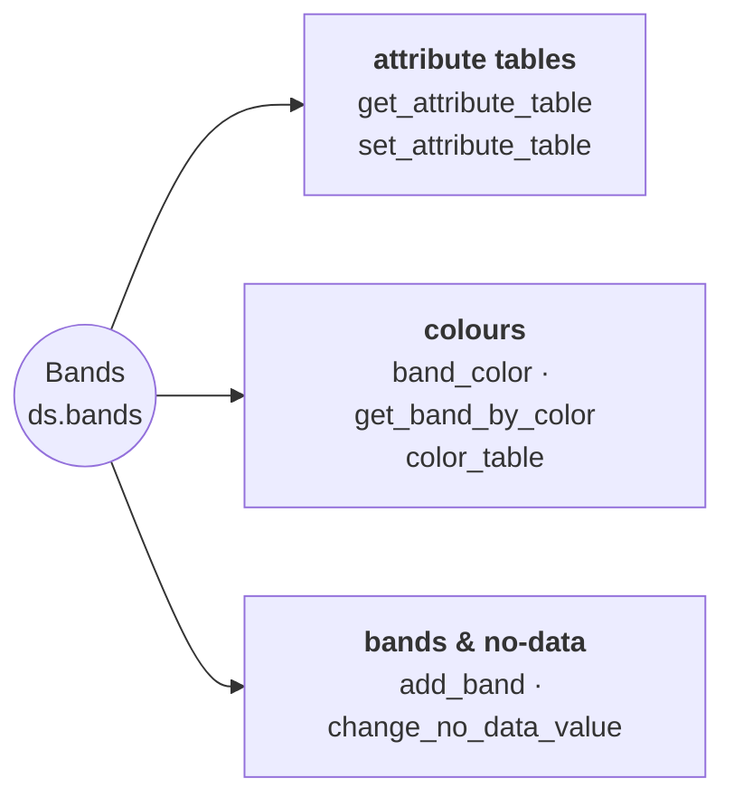

# Band Metadata & NoData

Band names, color tables, attribute tables, color interpretation, and no-data handling.

::: pyramids.dataset.engines.Bands
    options:
        show_root_heading: true
        show_source: true
        heading_level: 3
        members_order: source
