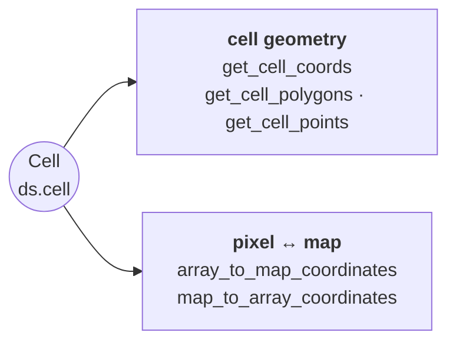

# Cell & Coordinate Operations

Cell coordinate retrieval, cell polygons/points, and map-to-array coordinate conversions.

::: pyramids.dataset.engines.Cell
    options:
        show_root_heading: true
        show_source: true
        heading_level: 3
        members_order: source
