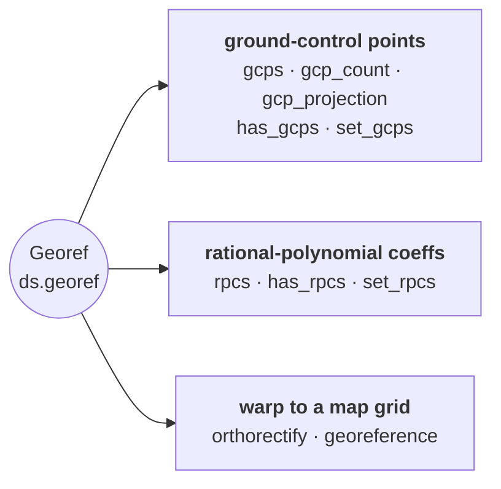

# Georeferencing (GCPs & RPCs)

Read, attach, and warp-from **ground-control points** and **rational-polynomial coefficients** to
georeference raw / un-orthorectified imagery — the one case where a raster is not described by a simple
affine geotransform. Accessed as `ds.georef`, with same-named facades on `Dataset` (`ds.gcps`,
`ds.set_gcps`, `ds.georeference`, `ds.rpcs`, `ds.set_rpcs`, `ds.orthorectify`).

Everything routes through GDAL — pyramids does not implement any sensor model itself.

::: pyramids.dataset.engines.Georef
    options:
        show_root_heading: true
        show_source: true

::: pyramids.dataset._gcp.GroundControlPoint
    options:
        show_root_heading: true
        show_source: true
