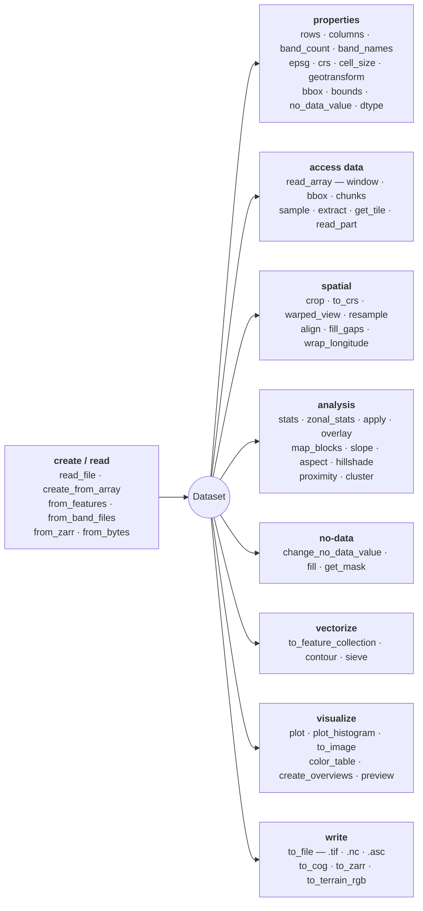
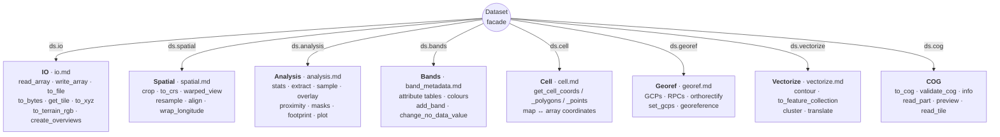
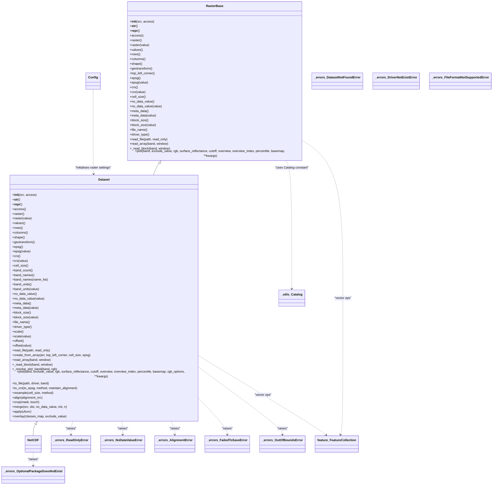

# Dataset Class

## At a glance

## Architecture — the engine layer

`Dataset` is a thin **facade**: each family of operations lives in its own engine
(`ds.io`, `ds.spatial`, …) and `ds.<method>(...)` forwards to `ds.<engine>.<method>(...)`.
The reference pages below are one per engine.

- Detailed class diagram for the `Dataset` class and related components:

```mermaid
classDiagram

    %% Central dataset class with its main attributes
    class Dataset {
        +raster
        +cell_size
        +values
        +shape
        +rows
        +columns
        +pivot_point
        +geotransform
        +bounds
        +bbox
        +epsg
        +crs
        +lon
        +lat
        +x
        +y
        +band_count
        +band_names
        +variables
        +no_data_value
        +meta_data
        +dtype
        +gdal_dtype
        +numpy_dtype
        +file_name
        +time_stamp
        +driver_type
    }

    %% Group: visualisation functionality
    class Visualization {
        +plot()
        +overview_count()
        +read_overview_array()
        +create_overviews()
        +recreate_overviews()
        +get_overview()
    }
    Dataset --> Visualization : «visualisation»

    %% Group: data access methods
    class AccessData {
        +read_array()
        +get_variables()
        +count_domain_cells()
        +get_band_names()
        +extract()
        +stats()
    }
    Dataset --> AccessData : «data access»

    %% Group: mathematical operations on raster values
    class MathOperations {
        +apply()
        +fill()
        +normalize()
        +cluster()
        +cluster2()
        +get_tile()
        +groupNeighbours()
    }
    Dataset --> MathOperations : «math ops»

    %% Group: spatial operations and reprojection
    class SpatialOperations {
        +to_crs()
        +resample()
        +align()
        +crop()
        +locate_points()
        +overlay()
        +extract()
        +footprint()
    }
    Dataset --> SpatialOperations : «spatial ops»

    %% Group: conversion to other data types
    class Conversion {
        +to_feature_collection()
    }
    Dataset --> Conversion : «conversion»

    %% Group: coordinate system handling
    class OSR {
        +create_sr_from_epsg()
    }
    Dataset --> OSR : «osr»

    %% Group: bounding‐box and bounds calculations
    class BBoxBounds {
        +calculate_bbox()
        +calculate_bounds()
    }
    Dataset --> BBoxBounds : «bbox/bounds»

    %% Group: CRS/EPSG getters
    class CrsEpsg {
        +get_crs()
        +get_epsg()
    }
    Dataset --> CrsEpsg : «crs/epsg»

    %% Group: latitude/longitude getters
    class LatLon {
        +get_lat_lon()
    }
    Dataset --> LatLon : «lat/lon»

    %% Group: band names management
    class BandNames {
        +get_band_names_internal()
        +set_band_names()
    }
    Dataset --> BandNames : «band names»

    %% Group: timestamp handling
    class TimeStamp {
        +get_time_variable()
        +read_variable()
    }
    Dataset --> TimeStamp : «time»

    %% Group: handling of no‐data values
    class NoDataValue {
        +set_no_data_value()
        +set_no_data_value_backend()
        +change_no_data_value_attr()
    }
    Dataset --> NoDataValue : «no data value»

    %% Group: helpers for creating GDAL datasets
    class GdalDataset {
        +create_empty_driver()
        +create_driver_from_scratch()
        +create_mem_gtiff_dataset()
    }
    Dataset --> GdalDataset : «gdal creation»

    %% Group: factory methods for creating Dataset objects
    class CreateObject {
        +from_gdal_dataset()
        +read_file()
        +create_from_array()
        +dataset_like()
        +from_bytes()
        +from_band_files()
        +from_archive()
    }
    Dataset --> CreateObject : «object factory»

```

## Factory methods at a glance

| Method | Use when |
|---|---|
| `read_file(path, vsi=…, file_i=…)` | Open a path, URL, or archive member (zip/tar/gzip). URLs auto-rewrite to `/vsi*`. |
| `from_bytes(data, suffix=".tif")` | The caller already holds the bytes (HTTP body, DB blob, S3 `get_object` payload). Backed by `/vsimem/`. |
| `from_band_files(paths)` | Stack N single-band rasters (one file per band) into one multi-band Dataset — the natural target for the `<asset>.<band>.tif` layout of GEE / Landsat / Sentinel downloads. |
| `from_archive(url_or_path, member_glob=…)` | Merge every matching member of a local or remote archive into one multi-band Dataset (composes `from_band_files` over `gdal.ReadDir`). For one-Dataset-per-member use `DatasetCollection.from_archive`. |
| `create_from_array(arr, …)` | Build a Dataset from a numpy array + geobox. |
| `dataset_like(template, arr)` | Stamp a new Dataset that inherits its grid / CRS from `template`. |

See the [Recipes](../../how-to/recipes.md) page for runnable examples
of each.

::: pyramids.dataset.Dataset
    options:
        show_root_heading: true
        show_source: true
        heading_level: 3
        members_order: source
