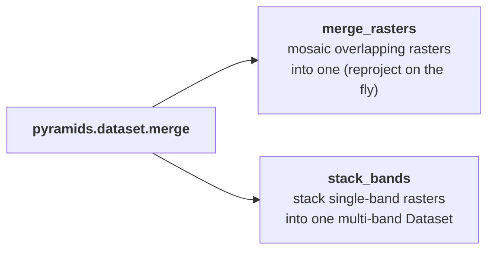

# Merge & stack

Free functions for combining multiple rasters into one.

- `merge_rasters` — mosaic several (overlapping or adjacent) rasters into a single raster covering
  their union.
- `stack_bands` — stack several single-band rasters into one multi-band raster.

See the [Mosaic & merge notebook](../../examples/operations/mosaic-merge.ipynb) for runnable
examples.

::: pyramids.dataset.merge.merge_rasters
    options:
        show_root_heading: true
        show_source: true
        heading_level: 3

::: pyramids.dataset.merge.stack_bands
    options:
        show_root_heading: true
        show_source: true
        heading_level: 3
