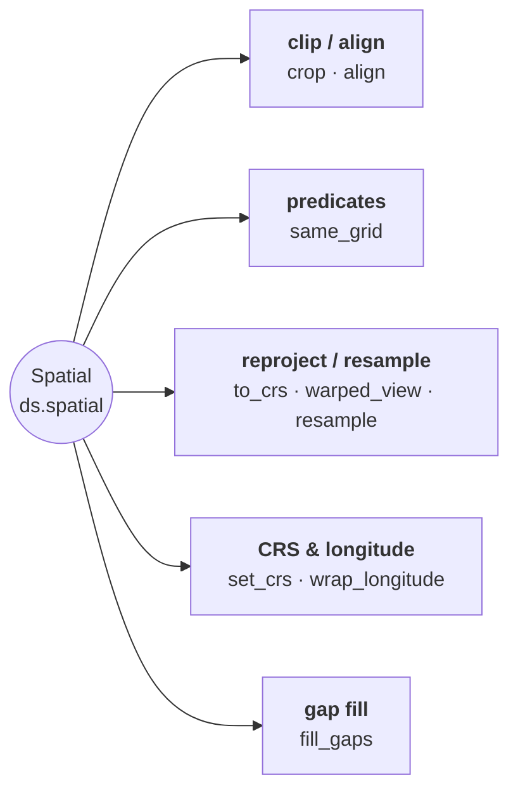

# Spatial Operations

Crop, align, reproject, resample, CRS handling, and coordinate conversion.

`ds.same_grid(other)` is the predicate behind them: it answers whether two rasters
occupy one pixel grid in one CRS, and so can be combined cell by cell without
resampling. `align` is what you call when the answer is no.



## Crop with a polygon, raster, or bbox tuple

`Dataset.crop(mask)` accepts a `FeatureCollection` / `GeoDataFrame`
polygon mask or another `Dataset` as a raster mask. For the common
"clip to a geographic bounding box" case, pass the keyword-only
`bbox=(W, S, E, N)` (and `epsg=` if the bbox isn't in the dataset's
own CRS) — pyramids builds the one-row `FeatureCollection` for you and
routes through the same polygon path. The same `bbox=` / `epsg=` pair
is accepted by `DatasetCollection.crop` (built once and reused across
timesteps) and by `Dataset.read_array` (for a windowed read).


### What a crop declares

The result declares the value its excluded cells hold, which is not always the source's. A band whose own
sentinel is storable keeps it. A band whose sentinel cannot be stored — `NaN` on an integer band — has one
derived against its own data: the first value that fits the dtype and occurs nowhere in the band. A floating
band always gets `NaN`.

A band that declares *nothing* depends on the mask. A raster mask writes the excluded cells itself, so it
derives a fill and declares it; a polygon mask lets GDAL fill them, so the source's declaration — none — stands.
`Int64` and `UInt64` are left alone on the polygon route as well, because `-dstnodata` reaches GDAL as a C
double that a value beyond `2**53` does not survive.

Two consequences worth knowing before you index against a result:

- the output can be **smaller** than the mask's extent, because rows and columns lying entirely outside it are
  trimmed once the result declares a sentinel the trim recognises;
- `crop` raises `NoDataValueError` when a band holds every candidate sentinel and no value is free to mark a
  cell as absent. It does **not** derive from `ValueError`.

```python
from pyramids.dataset import Dataset

ds = Dataset.read_file("dem.tif")

# bbox in the dataset's own CRS
ds.crop(bbox=(6.8, 50.3, 7.2, 50.6))

# bbox in WGS84 against a Web-Mercator raster
ds.crop(bbox=(6.8, 50.3, 7.2, 50.6), epsg=4326)
```

`mask=` and `bbox=` are mutually exclusive. If you need the underlying
one-row `FeatureCollection` for other ops, build it with
`FeatureCollection.from_bbox((W, S, E, N), epsg=…)`.

## Reproject — eager `to_crs(...)` vs lazy `warped_view(...)`

`Dataset.to_crs(to_epsg)` **materialises** a reprojected raster: it warps every
pixel into the target CRS and returns a new `Dataset`. Use it when you will
consume the whole reprojected result.

`Dataset.warped_view(crs)` returns a **lazy** reprojected view — an in-memory
warped VRT where nothing is resampled until a window is read, and a windowed
read warps only that window. Prefer it for tile serving, partial reads, and
chained virtual pipelines. The view pins its source alive.

| | `to_crs` | `warped_view` |
|--|----------|---------------|
| When pixels warp | immediately (whole raster) | lazily, per window read |
| Returns | a fully materialised `Dataset` | a VRT-backed view `Dataset` |
| Best for | consuming the whole result | tile serving / partial reads |

```python
from pyramids.dataset import Dataset

ds = Dataset.read_file("dem.tif")               # e.g. EPSG:4326
webmerc = ds.to_crs(3857)                       # eager: all pixels warped now
view = ds.warped_view(3857)                     # lazy: warps only what you read
tile = view.read_array(bbox=(...), epsg=3857)   # this window is warped on demand
```

Both accept a `method=` resampling name; `warped_view` also takes `cell_size=`
and `bbox=` to fix the output grid/extent up front.

::: pyramids.dataset.engines.Spatial
    options:
        show_root_heading: true
        show_source: true
        heading_level: 3
        members_order: source
