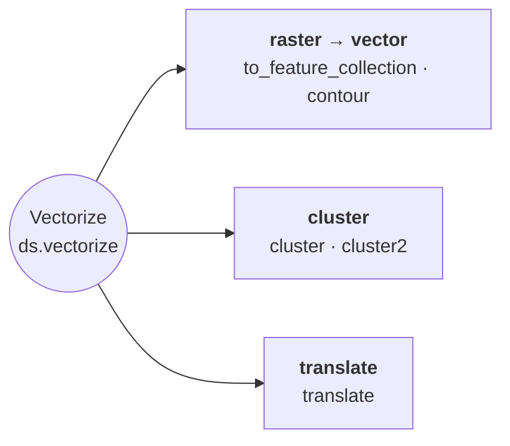

# Vectorization & Clustering

Raster-to-vector conversion, clustering, and translate.

::: pyramids.dataset.engines.Vectorize
    options:
        show_root_heading: true
        show_source: true
        heading_level: 3
        members_order: source
