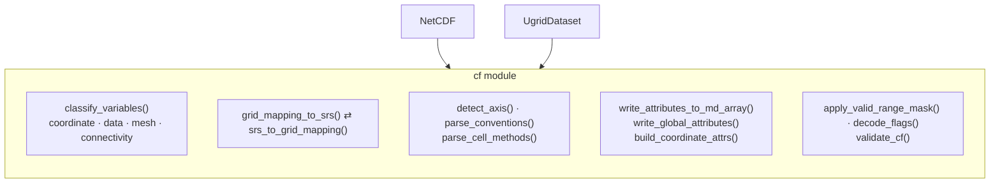

# CF Conventions Module

The `cf` module provides shared infrastructure for reading and writing
CF (Climate and Forecast) convention attributes. It is used by both the
structured `NetCDF` class and the unstructured `UgridDataset` class.

## Key Capabilities

- **Variable classification**: Detect coordinate, data, mesh topology,
  and connectivity variables via `classify_variables()`
- **CRS handling**: Convert between CF `grid_mapping` attributes and
  OGR `SpatialReference` via `grid_mapping_to_srs()` /
  `srs_to_grid_mapping()`
- **Attribute writing**: Write CF-compliant attributes to GDAL MDArrays
  and root groups
- **Axis detection**: Identify X/Y/Z/T axes from variable names,
  attributes, and units
- **Convention parsing**: Parse `Conventions` attribute strings
  (e.g., `"CF-1.8 UGRID-1.0"`)
- **Data masking**: Apply `valid_range`, `valid_min`, `valid_max` masks
- **Flag decoding**: Decode CF `flag_values` / `flag_meanings`

## Capability map

The `cf` module is a flat collection of helpers (no classes) shared by the structured `NetCDF` reader
and the unstructured `UgridDataset`. They group into five roles — classification, CRS translation,
convention parsing, attribute writing, and value decoding/validation:

## API Reference

::: pyramids.netcdf.cf.classify_variables
    options:
        show_root_heading: true
        show_source: true
        heading_level: 3

::: pyramids.netcdf.cf.grid_mapping_to_srs
    options:
        show_root_heading: true
        show_source: true
        heading_level: 3

::: pyramids.netcdf.cf.srs_to_grid_mapping
    options:
        show_root_heading: true
        show_source: true
        heading_level: 3

::: pyramids.netcdf.cf.write_attributes_to_md_array
    options:
        show_root_heading: true
        show_source: true
        heading_level: 3

::: pyramids.netcdf.cf.write_global_attributes
    options:
        show_root_heading: true
        show_source: true
        heading_level: 3

::: pyramids.netcdf.cf.build_coordinate_attrs
    options:
        show_root_heading: true
        show_source: true
        heading_level: 3

::: pyramids.netcdf.cf.detect_axis
    options:
        show_root_heading: true
        show_source: true
        heading_level: 3

::: pyramids.netcdf.cf.parse_conventions
    options:
        show_root_heading: true
        show_source: true
        heading_level: 3

::: pyramids.netcdf.cf.parse_cell_methods
    options:
        show_root_heading: true
        show_source: true
        heading_level: 3

::: pyramids.netcdf.cf.apply_valid_range_mask
    options:
        show_root_heading: true
        show_source: true
        heading_level: 3

::: pyramids.netcdf.cf.decode_flags
    options:
        show_root_heading: true
        show_source: true
        heading_level: 3

::: pyramids.netcdf.cf.validate_cf
    options:
        show_root_heading: true
        show_source: true
        heading_level: 3
