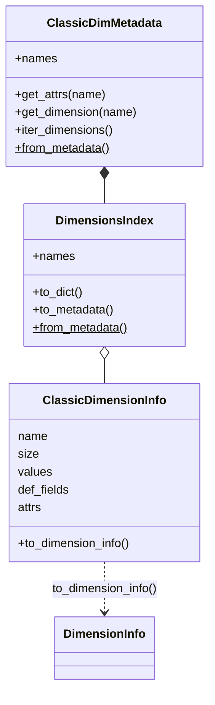

# Dimension Parsing

Dimension metadata extraction, time coordinate parsing, and
variable-dimension relationship handling for NetCDF files.

This module parses the classic-mode `NETCDF_DIM_*` metadata GDAL exposes on non-multidimensional
opens. `parse_gdal_netcdf_dimensions` builds a `DimensionsIndex` of `ClassicDimensionInfo` records;
`ClassicDimMetadata` pairs that index with the per-dimension attribute dicts, and each
`ClassicDimensionInfo` can convert to the MDim-mode [`DimensionInfo`](models.md) model:

::: pyramids.netcdf.dimensions
    options:
        show_root_heading: true
        show_source: true
        heading_level: 3
        members_order: source
