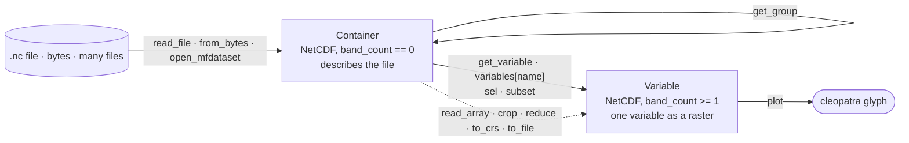
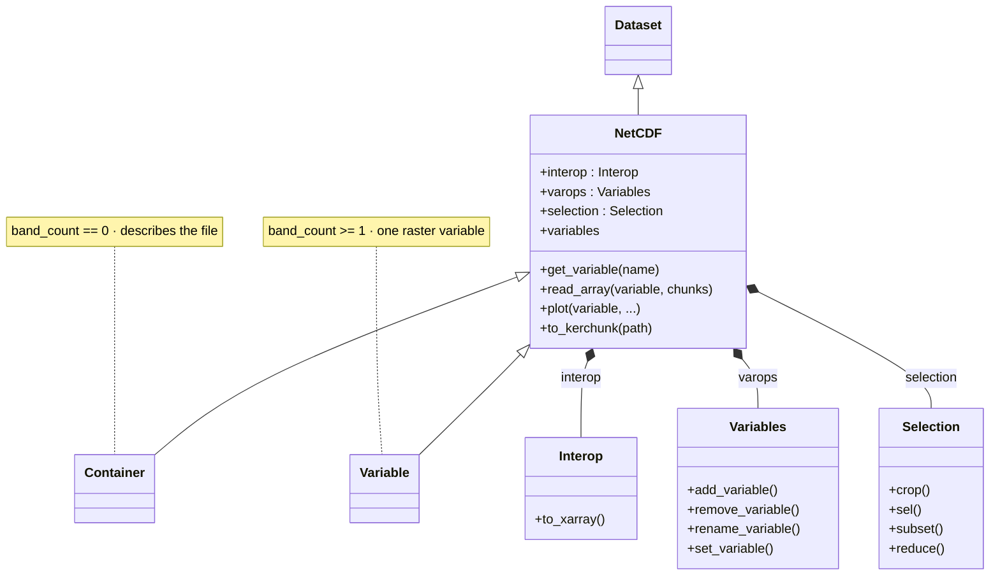
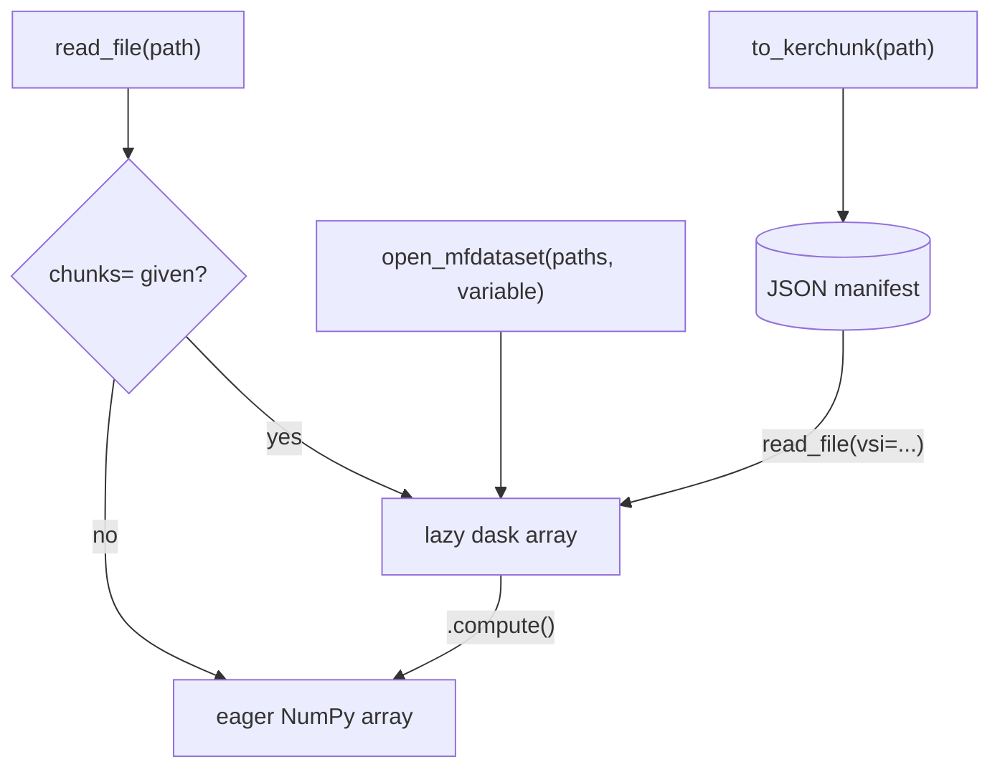

# NetCDF Class


The `NetCDF` class extends `Dataset` for structured (regular grid)
NetCDF files. It wraps GDAL's Multidimensional API to provide
variable access, time dimension handling, and CF-compliant metadata.

## Object model — container vs. variable

`read_file` (and `from_bytes` / `open_mfdataset`) return a **`Container`** — a `NetCDF` whose
`band_count == 0` that describes the whole file. Pinning one variable with `get_variable`,
`variables[name]`, `sel`, or `subset` returns a **`Variable`** — a `NetCDF` with `band_count >= 1`
that behaves as a single raster. `get_group` opens a nested NetCDF-4 group as its own container.



`NetCDF` inherits `Dataset`'s eight engines and adds three of its own — `interop`, `varops`, and
`selection` — which back the xarray-interop, variable-mutation, and selection facades on the class:



## Lazy / Dask reads

Every NetCDF entry point has a lazy variant that keeps memory bounded
on multi-GB reanalysis and climate-projection files:




| Entry point                              | Purpose                                        |
|------------------------------------------|------------------------------------------------|
| `NetCDF.read_array(chunks=…)`            | One file, one variable, partial reads          |
| `NetCDF.open_mfdataset(paths, variable)` | Many files → single stacked dask array         |
| `NetCDF.to_kerchunk(path)`               | Emit a JSON index so downstream reads are free |
| `NetCDF.combine_kerchunk(paths, …)`      | Combine per-file manifests into one cube index |
| `NetCDF.to_xarray()` / `.from_xarray()`  | Round-trip interop with `xarray.Dataset`       |

```python
from pyramids.netcdf import NetCDF

nc = NetCDF.read_file("era5.nc")
t2m = nc.read_array(
    "t2m", chunks={"time": 24, "lat": 256, "lon": 256},
)
t2m.mean(axis=0).compute()        # monthly mean, parallel
```

See [Lazy NetCDF](../../tutorials/lazy/lazy-netcdf.md) for chunk-size rules,
CF scale/offset unpacking, and kerchunk manifest emission.

Install: `pip install 'pyramids-gis[lazy]'` for the core path and
kerchunk manifests; `pip install xarray` (a peer dep, not a pyramids
extra) for the `to_xarray` / `from_xarray` round-trip helpers.

## Plotting

`NetCDF.plot` exposes an xarray-aligned plotting API — `variable=`, the grouped
`selectors=` / `colour=` / `facet=` dataclasses, curvilinear `coords=`, `kind=`,
`animate=`, and `chunks=` (lazy). It does **not** inherit `Dataset.plot`'s
GeoTIFF / Sentinel kwargs (`band`, `rgb`, `surface_reflectance`, `cutoff`,
`percentile`, `overview`, `overview_index`) — passing any of them raises `TypeError`.
See the [Plotting reference](plot.md) for the full surface and the `Selectors` /
`ColourOpts` / `FacetSpec` dataclasses, and the
[Plotting NetCDF data](../../tutorials/netcdf-plotting.md) tutorial for worked examples.
Requires the `[viz]` extra.

::: pyramids.netcdf.NetCDF
    options:
        show_root_heading: true
        show_source: true
        heading_level: 3
        members_order: source
