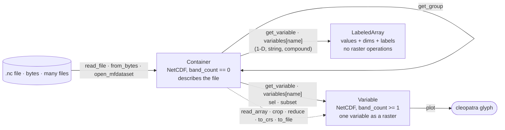
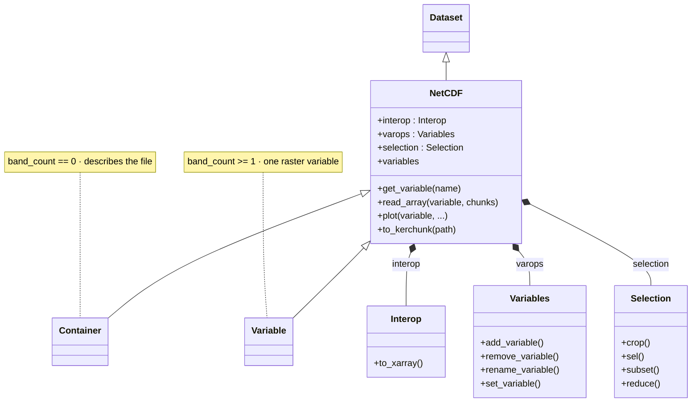
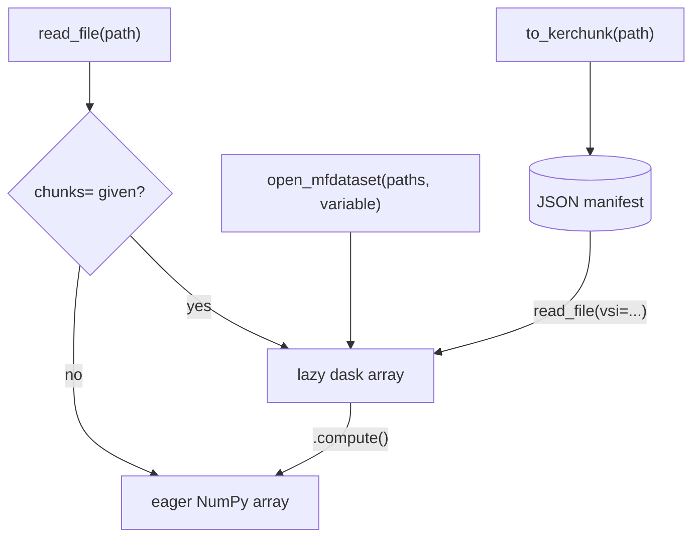

# NetCDF Class


The `NetCDF` class extends `Dataset` for structured (regular grid)
NetCDF files. It wraps GDAL's Multidimensional API to provide
variable access, time dimension handling, and CF-compliant metadata.

## Object model — container vs. variable

`read_file` (and `from_bytes` / `open_mfdataset`) return a **`Container`** — a `NetCDF` whose
`band_count == 0` that describes the whole file. Pinning one variable with `get_variable`,
`variables[name]`, `sel`, or `subset` returns a **`Variable`** — a `NetCDF` with `band_count >= 1`
that behaves as a single raster. `get_group` opens a nested NetCDF-4 group as its own container.

A variable GDAL cannot expose as a raster — a 1-D array such as a bounds or coordinate series, or a
string or compound array of any rank — comes back from `get_variable` and `variables[name]` as a
**`LabeledArray`** instead: its `values`, `dims` and `shape`, plus the `name`, `unit`,
`no_data_value`, `scale`, `offset` and `attributes` it declares. It has no raster operations, so
`crop_variable` and the other raster-only methods refuse it by name.



`NetCDF` inherits `Dataset`'s eight engines and adds three of its own — `interop`, `varops`, and
`selection` — which back the labeled-array interop, variable-mutation, and selection facades on the class:



## Dimension coordinates and selection

`dimension_names` / `dimension_sizes` name a cube's axes; `get_dimension_values(name)` reads the
coordinate values of any one of them — the vertical, ensemble or other non-spatial axis included,
which previously had no native accessor:

```python
nc = NetCDF.read_file("rhum.nc")
nc.dimension_sizes                    # {'lon': 72, 'lat': 37, 'level': 4, 'time': 12}
nc.get_dimension_values("level")      # array([1000.,  925.,  850.,  700.])
```

The values are the **stored** ones — the same array `to_xarray().coords` reports, without needing the
optional xarray extra. For a **spatial** axis that is not necessarily the raster's order: pyramids
presents rasters north-up, so on a south-to-north file `get_dimension_values("lat")` ascends while
`read_array()`'s row 0 is the northernmost row. Use `get_y_lat_dimension_array` when you want to index
rows; use this when you want to know what the file holds.

They match what `sel` selects on. A CF time axis is stored as
raw offsets; `get_time_variable()` decodes the same axis to date strings, and `sel` accepts either
vocabulary:

```python
var = nc.get_variable("rhum")

var.sel(level=850)                            # exact stored value
var.sel(level=900, method="nearest")          # snap to the closest level (925)
var.sel(time="2024-01-01 12:00:00")           # a full-precision label pins one step
var.sel(time="2024-01")                       # a partial label takes the whole month
var.sel(time=slice("2024-01-01", "2024-01-03"))
```

A label names a **period**, not an instant, so its precision decides how much it selects. That matters
when the label comes from `get_time_variable()`: its default `time_format` is `"%Y-%m-%d"`, so feeding
one of those labels straight back keeps every step of that day. Ask for the finer format when you want
one step:

```python
nc.get_time_variable("time")[1]                       # '2024-01-01'  -> the whole day
nc.get_time_variable("time", "%Y-%m-%d %H:%M:%S")[1]  # '2024-01-01 06:00:00'  -> one step
```

`method="nearest"` snaps each requested value to the closest coordinate on its axis, so a caller can
ask for "the level nearest 100 m" without knowing the axis values up front. It needs a numeric
selector — a slice has no nearest value, and a date label already names a period. Read back the
coordinate it chose with `get_dimension_values` on the result:

```python
pinned = var.sel(level=900, method="nearest")
pinned.get_dimension_values("level")   # array([925.])
```

Both reach `NetCDF.plot` through `Selectors(..., method="nearest")`.

## Lazy / Dask reads

Every NetCDF entry point has a lazy variant that keeps memory bounded
on multi-GB reanalysis and climate-projection files:




| Entry point                              | Purpose                                        |
|------------------------------------------|------------------------------------------------|
| `NetCDF.read_array(chunks=…)`            | One file, one variable, partial reads          |
| `NetCDF.open_mfdataset(paths, variable)` | Many files → single stacked dask array         |
| `NetCDF.to_kerchunk(path)`               | Emit a JSON index so downstream reads are free |
| `NetCDF.combine_kerchunk(paths, …)`      | Combine per-file manifests into one cube index |
| `NetCDF.to_xarray()` / `.from_xarray()`  | Round-trip interop with a labeled-array dataset |

```python
from pyramids.netcdf import NetCDF

nc = NetCDF.read_file("era5.nc")
t2m = nc.read_array(
    "t2m", chunks={"time": 24, "lat": 256, "lon": 256},
)
t2m.mean(axis=0).compute()        # monthly mean, parallel
```

See [Lazy NetCDF](../../tutorials/lazy/lazy-netcdf.md) for chunk-size rules,
CF scale/offset unpacking, and kerchunk manifest emission.

Install: `pip install 'pyramids-gis[lazy]'` for the core path and
kerchunk manifests; `pip install xarray` (a peer dep, not a pyramids
extra) for the `to_xarray` / `from_xarray` round-trip helpers.

## Plotting

`NetCDF.plot` exposes a labeled-array-style plotting API that mirrors `Dataset.plot` — `variable=`, the grouped
`selectors=` / `facet=` dataclasses, curvilinear coordinates via `axes=CoordinateSpec(...)`, loose colour
kwargs (`cmap`, `vmin`, `vmax`, `robust`, `center`, `extend`, `levels`, `norm`), `kind=`,
`animate=`, and `chunks=` (lazy). It does **not** inherit `Dataset.plot`'s
GeoTIFF / Sentinel kwargs (`band`, `rgb`, `surface_reflectance`, `cutoff`,
`percentile`, `overview`, `overview_index`) — passing any of them raises `TypeError`.
See the [Plotting reference](plot.md) for the full surface and the `Selectors` /
`CoordinateSpec` / `FacetSpec` dataclasses, and the
[Plotting NetCDF data](../../tutorials/netcdf-plotting.md) tutorial for worked examples.
Requires the `[viz]` extra.

::: pyramids.netcdf.NetCDF
    options:
        show_root_heading: true
        show_source: true
        heading_level: 3
        members_order: source
