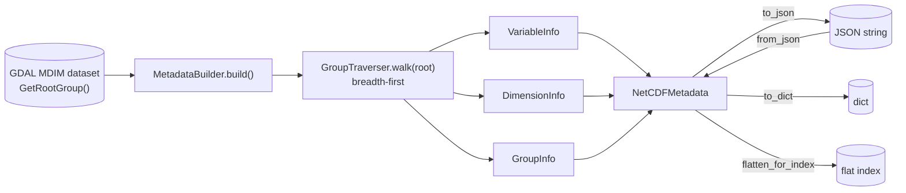

# NetCDF metadata extraction

Enumerate and normalize all metadata from NetCDF files using GDAL's Multidimensional (MDim) API.

Overview:

- Open NetCDF files as MDArray-backed datasets
- Traverse groups, arrays, dimensions, and attributes
- Produce a JSON-serializable metadata object
- Keep compatibility with the existing dimension parser exposed via `NetCDF.meta_data`

## Pipeline

`get_metadata` drives a `MetadataBuilder`, which hands a `GroupTraverser` the root group and walks it
breadth-first, emitting one info record per group / array / dimension into the aggregate
`NetCDFMetadata`. The result serializes to JSON, a plain dict, or a flat search index — and round-trips
back from JSON:



`to_json`, `to_dict`, `from_json`, and `flatten_for_index` (the edge labels above) are **module-level
functions** in `pyramids.netcdf.metadata` that take a `NetCDFMetadata` argument — not methods on the
class. `NetCDFMetadata`'s only public method is `get_dimension`.

See the [data models](models.md) for the structure of each info record.

## Usage

Read all metadata from a file:

```python
from pyramids.netcdf.netcdf import NetCDF
from pyramids.netcdf.metadata import to_json

# Open the file in MDIM mode
nc = NetCDF.read_file("tests/data/netcdf/pyramids-netcdf-3d.nc", open_as_multi_dimensional=True)

# Read everything (groups, arrays, dimensions, attributes)
md = nc.get_all_metadata()

# Convert to JSON
print(to_json(md))
```

You can also pass open options (persisted into the result for provenance):

```python
md = nc.get_all_metadata(open_options={"OPEN_SHARED": "YES"})
```

## Dimension overview

For convenience and backward compatibility, the returned metadata includes a `dimension_overview`
section summarizing parsed dimensions using the existing `dimensions.MetaData` logic.

Shape:

- `names`: `list[str]`
- `sizes`: `dict[str, int]`
- `attrs`: `dict[str, dict[str, str]]`
- `values`: `dict[str, list[int | float | str]] | None`

This mirrors `nc.meta_data` and provides a compact CF-friendly view.

## Notes

- The feature uses GDAL's MDim API starting at `dataset.GetRootGroup()`.
- Attributes are normalized to JSON-friendly scalars or vectors; bytes are decoded as UTF-8.
- Convenience fields on arrays include: unit, nodata (`_FillValue` / `missing_value` precedence),
  scale/offset, CRS (WKT/PROJJSON), structural info, block size, and coordinate variables.
- No array data values are read; only metadata.
- The module provides helpers to serialize to/from JSON and to a plain dict.

## References

- [GDAL Multidimensional API](https://gdal.org/api/python/osgeo.gdal_array.MDArray-class.html)
- [netCDF driver](https://gdal.org/drivers/raster/netcdf.html)
- [gdal_mdim_info utility](https://gdal.org/programs/gdalmdiminfo.html)

## API

Functions for extracting, serializing, and deserializing NetCDF metadata using GDAL's
Multidimensional API.

::: pyramids.netcdf.metadata.get_metadata
    options:
        show_root_heading: true
        show_source: true
        heading_level: 3

::: pyramids.netcdf.metadata.to_json
    options:
        show_root_heading: true
        show_source: true
        heading_level: 3

::: pyramids.netcdf.metadata.from_json
    options:
        show_root_heading: true
        show_source: true
        heading_level: 3

::: pyramids.netcdf.metadata.to_dict
    options:
        show_root_heading: true
        show_source: true
        heading_level: 3
