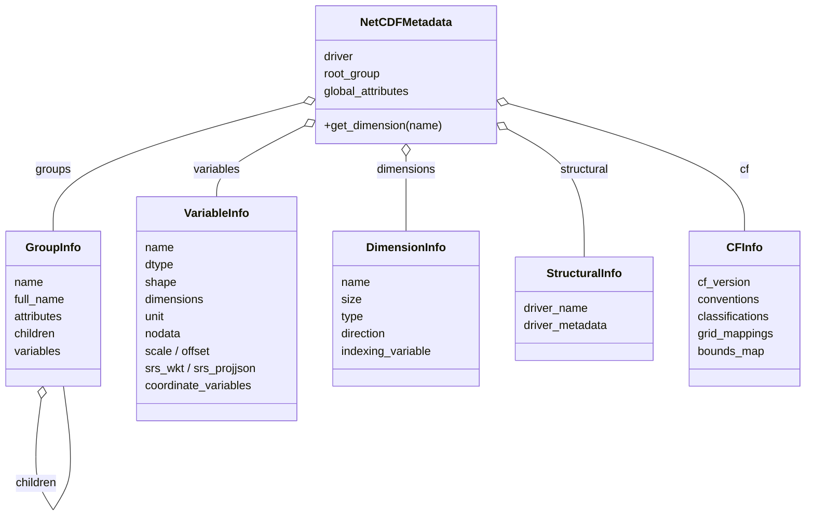

# NetCDF Data Models

Immutable dataclasses for NetCDF metadata: variables, dimensions,
groups, CF info, and the top-level `NetCDFMetadata` container.

`NetCDFMetadata` is the aggregate the [metadata extractor](metadata.md) builds. It composes the
per-element info records below — one `VariableInfo` per array, one `DimensionInfo` per dimension, a
`GroupInfo` tree, a single `StructuralInfo` (driver-level) and a single `CFInfo` (CF cross-reference):

::: pyramids.netcdf.models.NetCDFMetadata
    options:
        show_root_heading: true
        show_source: true
        heading_level: 3
        members_order: source

::: pyramids.netcdf.models.VariableInfo
    options:
        show_root_heading: true
        show_source: true
        heading_level: 3
        members_order: source

::: pyramids.netcdf.models.DimensionInfo
    options:
        show_root_heading: true
        show_source: true
        heading_level: 3
        members_order: source

::: pyramids.netcdf.models.GroupInfo
    options:
        show_root_heading: true
        show_source: true
        heading_level: 3
        members_order: source

::: pyramids.netcdf.models.CFInfo
    options:
        show_root_heading: true
        show_source: true
        heading_level: 3
        members_order: source

::: pyramids.netcdf.models.StructuralInfo
    options:
        show_root_heading: true
        show_source: true
        heading_level: 3
        members_order: source
