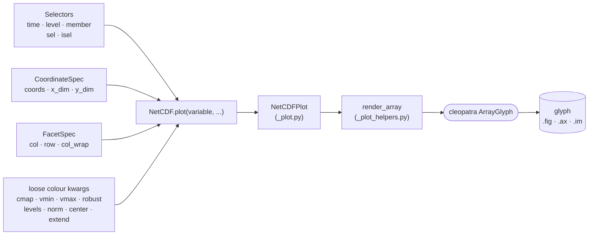

# Plotting

> For a worked, example-driven walkthrough see the
> [**Plotting NetCDF data**](../../tutorials/netcdf-plotting.md) tutorial. This page is the API
> reference (signature table + the auto-generated `Selectors` / `CoordinateSpec` / `FacetSpec` docs).

`NetCDF.plot` mirrors `Dataset.plot`'s signature. You pick a *variable*, slice along the
non-spatial dimensions, pass faceting / coordinate options through small grouped, frozen dataclasses
(`Selectors`, `CoordinateSpec`, `FacetSpec`) re-exported from `pyramids.netcdf`, and express colour
exactly as `Dataset.plot` does — through loose keyword arguments plus the shared cleopatra render bags.

The option bags and loose kwargs feed `NetCDF.plot`, which is a thin facade over `NetCDFPlot` (`_plot.py`). That
resolves the variable/slice and hands the array to the shared `render_array` core (`_plot_helpers.py`)
— the same renderer behind `Dataset.plot` and `DatasetCollection.plot` — which draws into a cleopatra
`ArrayGlyph` and returns the glyph (`.fig` / `.ax` / `.im`):



> Colour is expressed exactly as on `Dataset.plot` — via loose keyword arguments (`cmap`, `vmin`, `vmax`,
> `robust`, `center`, `extend`, `levels`, `norm`) plus the cleopatra render bags (`colorbar=`, `color=`,
> `contour=`, `cells=`, `data_style=`). There is no dedicated colour-options parameter — the colour knobs
> are loose kwargs, and `colorbar=False` hides the colour bar.

```python
from pyramids.netcdf import NetCDF, Selectors, CoordinateSpec, FacetSpec

nc = NetCDF.read_file("era5.nc")

# pick a variable, select along non-spatial dims, labeled-array-style colour kwargs
nc.plot("t2m", selectors=Selectors(time="2020-01-01", level=850),
        cmap="coolwarm", robust=True)

# curvilinear (WRF) grid -> pcolormesh, faceted over time
nc.plot("T2", axes=CoordinateSpec(coords=(XLONG, XLAT)), kind="pcolormesh",
        facet=FacetSpec(col="time", col_wrap=4))

# animate over a dimension with lazy, per-frame reads ([lazy] extra)
nc.plot("t2m", animate="time", chunks={"time": 1})
```

## Signature

`NetCDF.plot(variable=None, *, selectors=None, facet=None, axes=None, kind="auto",
animate=None, chunks=None, basemap=None, exclude_value=None, title=None, **kwargs)`

| Parameter   | Type                                | Notes |
|-------------|-------------------------------------|-------|
| `variable`  | `str`, optional                     | Variable to plot; defaults to the dataset's single / active variable. |
| `selectors` | `Selectors`, optional               | Slice along non-spatial dimensions — `time=`, `level=`, `member=`, plus generic `sel=` / `isel=`. |
| `facet`     | `FacetSpec`, optional               | Small-multiples grid — `col=`, `row=`, `col_wrap=`. |
| `axes`      | `CoordinateSpec`, optional          | Curvilinear coords / dimension names — `coords=(x_2d, y_2d)` (-> `pcolormesh`), `x_dim=`, `y_dim=`. Auto-detected from CF / WRF / ROMS / NEMO when omitted. |
| `kind`      | `str`, optional                     | `"auto"`, `"imshow"`, `"pcolormesh"`, `"contour"`, `"contourf"`. |
| `animate`   | `bool` or `str`, optional           | Animate over a dimension (its name, or `True` for the leading non-spatial dimension). |
| `chunks`    | `dict`, optional                    | Dask chunking — switches to a lazy read; only the rendered slice / frame is materialised. Requires the `[lazy]` extra. |
| `basemap`   | `bool` or `str`, optional           | Overlay a web-tile basemap (provider name as a string, e.g. `"CartoDB.Positron"`). Requires the `[viz]` extra. |
| `**kwargs`  |                                     | Colour, exactly as `Dataset.plot`: loose kwargs (`cmap`, `vmin`, `vmax`, `robust`, `center`, `extend`, `levels`, `norm`) + cleopatra bags `colorbar=` (`ColorBar(...)` / `False`), `color=`, `contour=`, `cells=`, `data_style=`; plus `ax`, `figsize`. |

The GeoTIFF-only kwargs `band`, `rgb`, `surface_reflectance`, `cutoff`, `percentile`, `overview`,
and `overview_index` are **not** accepted on `NetCDF.plot` — passing any of them raises `TypeError`
with a hint pointing at the replacement above (use `selectors=` to pick a slice, loose colour kwargs
such as `cmap=` / `robust=` for the colour scale, and so on).

Internally `NetCDF.plot` is a thin facade over `pyramids.netcdf._plot.NetCDFPlot`, which shares the
`pyramids.dataset._plot_helpers.render_array` rendering core with `Dataset.plot` and
`DatasetCollection.plot` (and `mesh_render` with `UgridDataset.plot`). The full rendered method
signature and docstring are on the [NetCDF Class](index.md) reference page.

## Option dataclasses

::: pyramids.netcdf.Selectors
    options:
        show_root_heading: true
        show_source: true
        heading_level: 3

::: pyramids.netcdf.CoordinateSpec
    options:
        show_root_heading: true
        show_source: true
        heading_level: 3

::: pyramids.netcdf.FacetSpec
    options:
        show_root_heading: true
        show_source: true
        heading_level: 3
