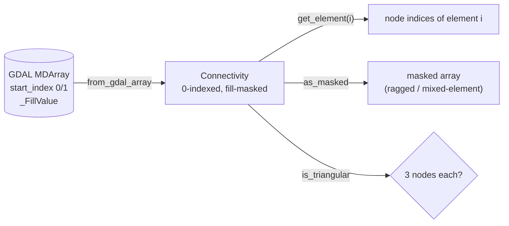

# Connectivity

Wrapper for UGRID connectivity arrays that handles `start_index`
normalization (always 0-indexed internally) and `_FillValue`
masking for mixed-element meshes.

`from_gdal_array` reads the raw array (which may be 1-based per UGRID) and normalizes it to a 0-indexed,
fill-masked internal form; the accessors then read individual elements or a fully masked view:

::: pyramids.netcdf.ugrid.Connectivity
    options:
        show_root_heading: true
        show_source: true
        heading_level: 3
        members_order: source
