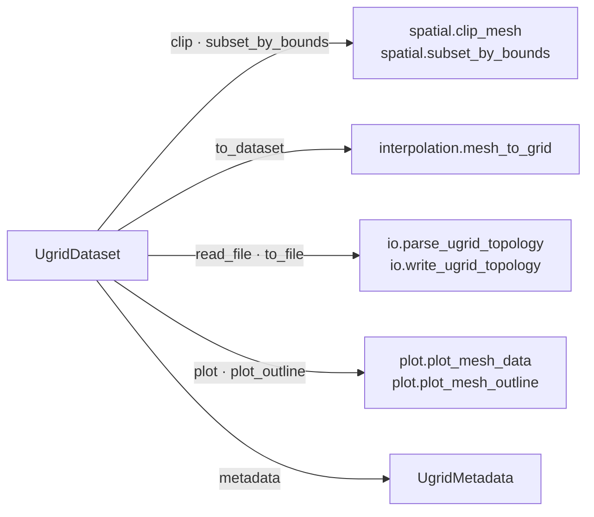

# UgridDataset

Top-level container for UGRID NetCDF mesh data. Provides the
user-facing API for reading, writing, inspecting, and operating
on unstructured mesh data.

`UgridDataset` is a thin, GIS-aware facade: its public methods delegate the heavy lifting to the
sibling modules of the subpackage (spatial ops, interpolation, I/O, plotting):

See the [subpackage overview](index.md) for how `UgridDataset` composes `Mesh2d`, `Connectivity`, and
`MeshVariable`.

::: pyramids.netcdf.ugrid.UgridDataset
    options:
        show_root_heading: true
        show_source: true
        heading_level: 3
        members_order: source
