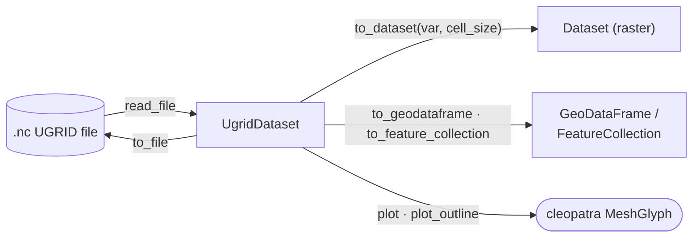

# UGRID Subpackage

The `ugrid` subpackage provides full support for UGRID (Unstructured
Grid) NetCDF files used in hydrological and coastal modeling (D-Flow FM,
SCHISM, FVCOM, ADCIRC).

## Architecture

`UgridDataset` is a standalone class that does **not** inherit from
`Dataset` or `RasterBase`. Unstructured meshes have no
geotransform, rows, or columns. Instead, data is indexed by topology
elements (nodes, faces, edges).

`UgridDataset` holds a `Mesh2d` (the topology), a `dict[str, MeshVariable]` (the data on nodes / faces
/ edges), and a `MeshTopologyInfo`. `Mesh2d` in turn holds several `Connectivity` arrays:

```mermaid
classDiagram
    class UgridDataset {
      +mesh : Mesh2d
      +data_variable_names
      +n_node / n_face / n_edge
      +bounds · crs · epsg
      +get_data(name)
      +to_dataset(var, cell_size)
      +to_geodataframe(var, location)
      +clip(mask) · crop() · subset_by_bounds()
      +to_crs(epsg) · to_file(path)
      +plot(var) · plot_outline()
    }
    class Mesh2d {
      +node_x / node_y
      +n_node / n_face / n_edge
      +face_centroids · face_areas
      +get_face_polygon(i)
    }
    class Connectivity {
      data · fill_value · cf_role
      +get_element(i)
      +is_triangular()
    }
    class MeshVariable {
      name · location · shape
      +data
      +sel_time(i)
    }
    class MeshTopologyInfo
    UgridDataset *-- Mesh2d : mesh
    UgridDataset o-- MeshVariable : data_variables
    UgridDataset o-- MeshTopologyInfo
    Mesh2d *-- Connectivity : face_node / edge_node / ...
```



The dataset is standalone (no geotransform / rows / columns) but bridges to the raster and vector
worlds on demand — rasterize with `to_dataset`, vectorize with `to_geodataframe` /
`to_feature_collection`, and render through cleopatra's `MeshGlyph`:



## Quick Start

```python
from pyramids.netcdf.ugrid import UgridDataset

# Read a UGRID file
ds = UgridDataset.read_file("model_output.nc")
print(ds)

# Access mesh topology
print(f"Nodes: {ds.n_node}, Faces: {ds.n_face}, Edges: {ds.n_edge}")
print(f"Bounds: {ds.bounds}")

# Access data
water_level = ds["water_level"]
print(f"Location: {water_level.location}, Shape: {water_level.shape}")

# Convert to regular grid (raster)
raster = ds.to_dataset("water_level", cell_size=100.0)
raster.to_file("water_level.tif")

# Convert to GeoDataFrame
gdf = ds.to_geodataframe("water_level", location="face")

# Clip to a polygon
clipped = ds.clip(polygon_mask)

# Reproject
reprojected = ds.to_crs(4326)
```

## Module Reference

| Module | Description |
|--------|-------------|
| [dataset](dataset.md) | `UgridDataset` main entry point |
| [mesh](mesh.md) | `Mesh2d` topology class |
| [connectivity](connectivity.md) | `Connectivity` array wrapper |
| [spatial](spatial.md) | Spatial indexing, clipping, subsetting |
| [interpolation](interpolation.md) | Mesh-to-grid interpolation |
| [io](io.md) | Topology detection and NetCDF I/O |
| [models](models.md) | Data model classes |
| [plot](plot.md) | Mesh visualization |
