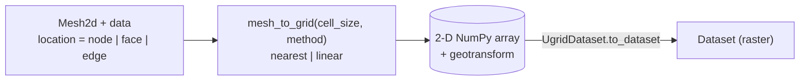

# Mesh-to-Grid Interpolation

Converts unstructured mesh data to regular grids using
nearest-neighbor or linear interpolation. This module
implements the bridge between `UgridDataset` and `Dataset`.

`mesh_to_grid` takes a `Mesh2d`, a data array on a given location (node / face / edge) and a target
cell size, and returns a 2-D array plus its geotransform — the raw material `UgridDataset.to_dataset`
wraps into a `Dataset`:

::: pyramids.netcdf.ugrid.interpolation.mesh_to_grid
    options:
        show_root_heading: true
        show_source: true
        heading_level: 3
