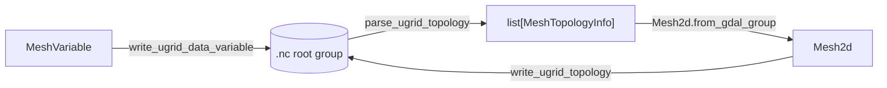

# Topology Detection and I/O

UGRID topology detection from NetCDF files using GDAL's
Multidimensional API, and UGRID-compliant NetCDF writing.

On read, `parse_ugrid_topology` scans the root group for mesh topology variables and returns one
`MeshTopologyInfo` per mesh, which `Mesh2d.from_gdal_group` turns into topology. On write, the topology
and each data variable are emitted back as CF/UGRID-compliant arrays:

::: pyramids.netcdf.ugrid.io.parse_ugrid_topology
    options:
        show_root_heading: true
        show_source: true
        heading_level: 3

::: pyramids.netcdf.ugrid.io.write_ugrid_topology
    options:
        show_root_heading: true
        show_source: true
        heading_level: 3

::: pyramids.netcdf.ugrid.io.write_ugrid_data_variable
    options:
        show_root_heading: true
        show_source: true
        heading_level: 3
