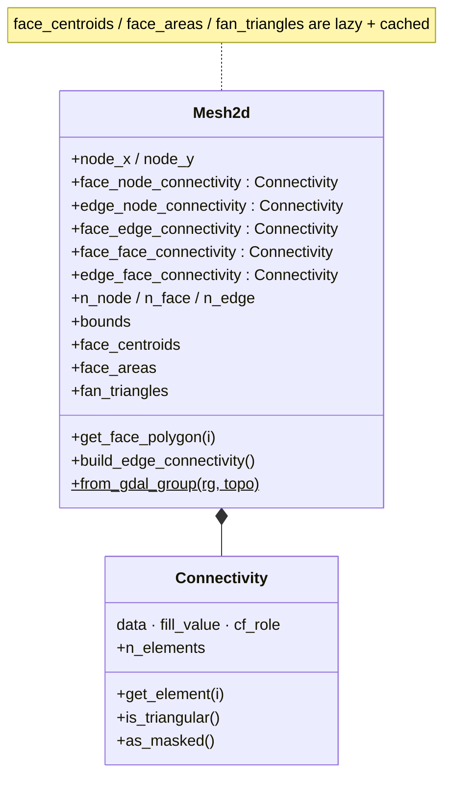

# Mesh2d

2D unstructured mesh topology class. Holds node coordinates,
face/edge connectivity arrays, and lazy-computed geometric
properties (centroids, areas, triangulation).

`Mesh2d` is pure NumPy plus up to five `Connectivity` arrays — it holds no GDAL handles. Geometric
properties (`face_centroids`, `face_areas`, `fan_triangles`) are computed on first access and cached:

::: pyramids.netcdf.ugrid.Mesh2d
    options:
        show_root_heading: true
        show_source: true
        heading_level: 3
        members_order: source
