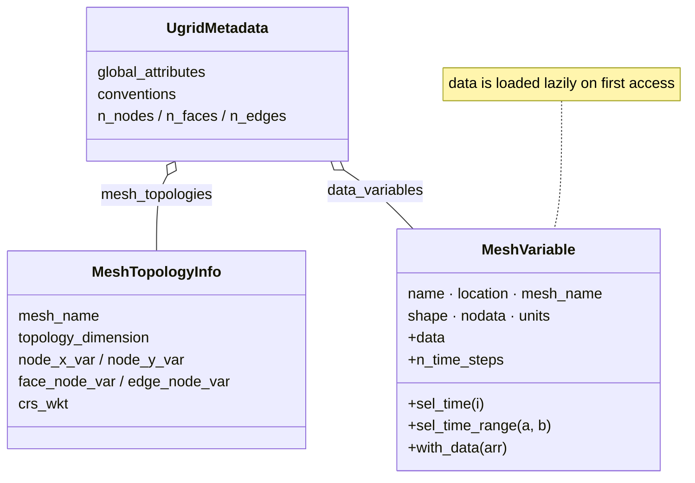

# UGRID Data Models

Dataclasses for UGRID topology metadata, mesh variables, and
dataset-level metadata summaries.

`UgridMetadata` is the dataset-level summary, aggregating one `MeshTopologyInfo` per mesh and the
`MeshVariable` records. `MeshVariable` carries a lazy loader so its `data` is only materialised on
access, and offers time-slicing helpers:

::: pyramids.netcdf.ugrid.MeshTopologyInfo
    options:
        show_root_heading: true
        show_source: true
        heading_level: 3
        members_order: source

::: pyramids.netcdf.ugrid.MeshVariable
    options:
        show_root_heading: true
        show_source: true
        heading_level: 3
        members_order: source

::: pyramids.netcdf.ugrid.UgridMetadata
    options:
        show_root_heading: true
        show_source: true
        heading_level: 3
        members_order: source
