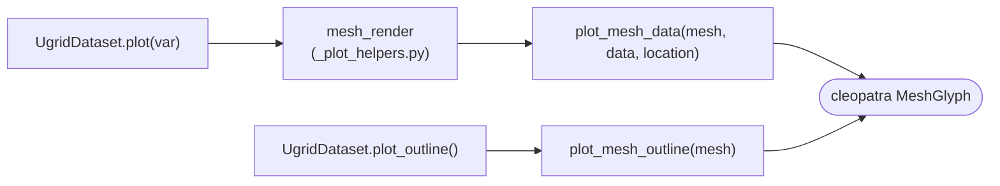

# Mesh Visualization

Mesh data plotting using matplotlib triangulation (tripcolor,
tricontourf) and wireframe rendering via LineCollection.

`UgridDataset.plot` is a thin facade over the shared module-level helper
`pyramids.dataset._plot_helpers.mesh_render` — the same "resolve the data, hand it to one
helper (which also applies the optional web-tile basemap)" contract used by the raster path
(`Dataset.plot` / `NetCDF.plot`). The functions below are the low-level entry points it builds
on; the cleopatra optional dependency is checked via `pyramids.base._utils.require_cleopatra`.

::: pyramids.netcdf.ugrid.plot.plot_mesh_data
    options:
        show_root_heading: true
        show_source: true
        heading_level: 3

::: pyramids.netcdf.ugrid.plot.plot_mesh_outline
    options:
        show_root_heading: true
        show_source: true
        heading_level: 3
