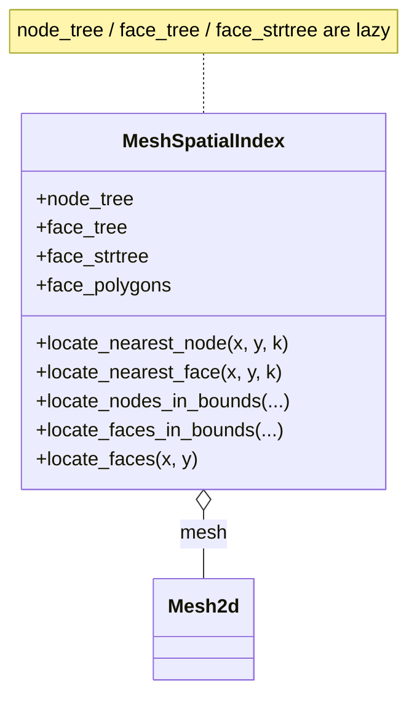

# Spatial Operations

Spatial indexing (KD-tree, STRtree), point-in-face queries, mesh
clipping by polygon, and bounding box subsetting.

`MeshSpatialIndex` wraps a `Mesh2d` and builds its KD-trees / STRtree lazily on first query. The
module-level `clip_mesh` / `subset_by_bounds` functions use it to return a new `(Mesh2d, data)` pair —
they back `UgridDataset.clip` and `UgridDataset.subset_by_bounds`:

::: pyramids.netcdf.ugrid.MeshSpatialIndex
    options:
        show_root_heading: true
        show_source: true
        heading_level: 3
        members_order: source

::: pyramids.netcdf.ugrid.spatial.clip_mesh
    options:
        show_root_heading: true
        show_source: true
        heading_level: 3

::: pyramids.netcdf.ugrid.spatial.subset_by_bounds
    options:
        show_root_heading: true
        show_source: true
        heading_level: 3
