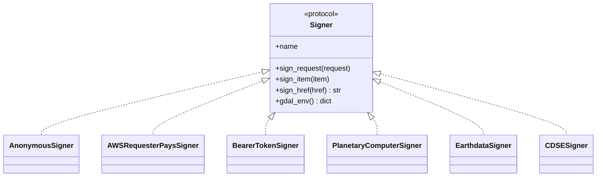

# STAC Subpackage

The `pyramids.stac` subpackage connects pyramids to the
[SpatioTemporal Asset Catalog](https://stacspec.org/) ecosystem — searching STAC
APIs, reading assets as pyramids `Dataset` / `NetCDF` objects, building cubes,
signing cloud credentials, and writing STAC Items back out. Everything is
**GDAL-native** (no rasterio, no xarray) and **duck-typed** over the STAC
Item/Asset contract, so `pystac` is never imported by pyramids itself — raw STAC
JSON dicts work as well as `pystac.Item` objects.

## Module layout



## Public API at a glance

| Concern | Symbol | Page |
|---------|--------|------|
| Open a STAC API client | `open_client` | [Client & search](#client) |
| Typed item search | `search` (bbox/intersects/datetime/query/CQL2) | [Client & search](#search) |
| Read one asset → `Dataset`/`NetCDF` | `load_asset` · `which_engine` · `resolved_href` | [Assets](assets.md) |
| Read `proj`/`raster`/`eo` metadata (no file open) | `read_extension_metadata` | [Assets](assets.md) |
| Mosaic one asset across items (lazy VRT) | `build_vrt_from_stac` | [Assets](assets.md) |
| Download assets to local files (`[stac]` extra) | `download_item` | [Assets](assets.md) |
| Serialize items ↔ GeoParquet (`[parquet]` extra) | `to_geoparquet` · `from_geoparquet` | [Assets](assets.md) |
| Cloud credentials (6 signers) | `Signer` protocol + concrete signers | [Signers](signers.md) |

Two STAC entry points live on the raster classes (documented there):

- **`DatasetCollection.from_stac(items, asset, *, signer, align, skip_missing, groupby, like, crs, resolution,
  bounds)`** — build a time-stacked cube from STAC items (single asset → time stack, or a
  list of assets → band axis; `groupby="solar_day"` mosaics same-overpass tiles;
  `like=`/`crs`+`resolution`+`bounds` matches a target grid).
  See [DatasetCollection](../dataset_collection.md).
- **`DatasetCollection.from_point(lat, lon, *, collection, bands, start_date, end_date, edge_size, resolution)`**
  — a cubo-style point + edge-size convenience cube. See
  [DatasetCollection](../dataset_collection.md).
- **`Dataset.to_stac_item(item_id, *, asset_href, …)`** — describe a raster as a
  STAC Item dict (`proj` + `raster` extensions). See [I/O](../dataset/io.md).

## Install

`open_client` / `search` need the `[stac]` extra (which also bundles the optional
asset downloader `stac-asset`); `read_extension_metadata`, `load_asset`,
`build_vrt_from_stac`, `to_stac_item`, and the signers need only core pyramids:

```bash
pip install 'pyramids-gis[stac]'           # client/search + download_item
pip install 'pyramids-gis[stac,parquet]'   # + GeoParquet round-trip
```

See the [STAC tutorial](../../tutorials/stac.md) for an end-to-end walkthrough,
the [offline STAC notebook](../../examples/stac/stac-local.ipynb), and the
live-endpoint notebooks for
[Earth Search](../../examples/stac/stac-cloud-earth-search.ipynb) (anonymous) and
the [Planetary Computer](../../examples/stac/stac-cloud-planetary-computer.ipynb)
(signed).

## Client & search

<a id="client"></a>

::: pyramids.stac.client
    options:
        show_root_heading: true
        show_source: true
        heading_level: 3
        members_order: source

<a id="search"></a>

::: pyramids.stac.search
    options:
        show_root_heading: true
        show_source: true
        heading_level: 3
        members_order: source
